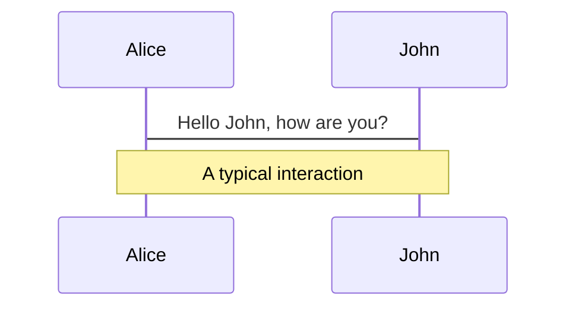
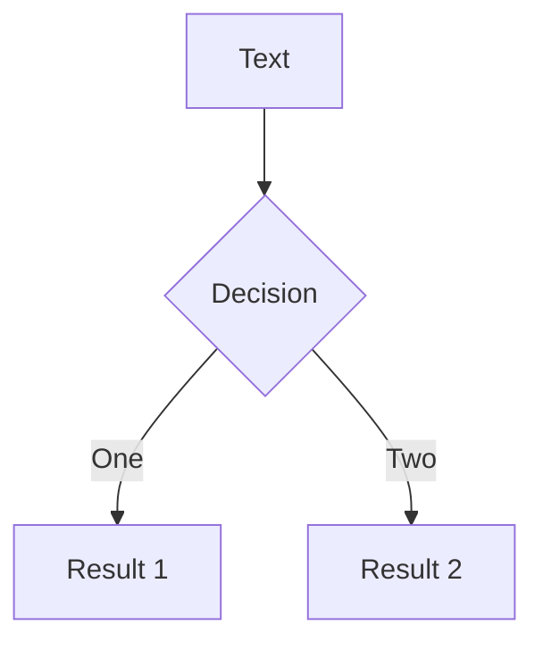
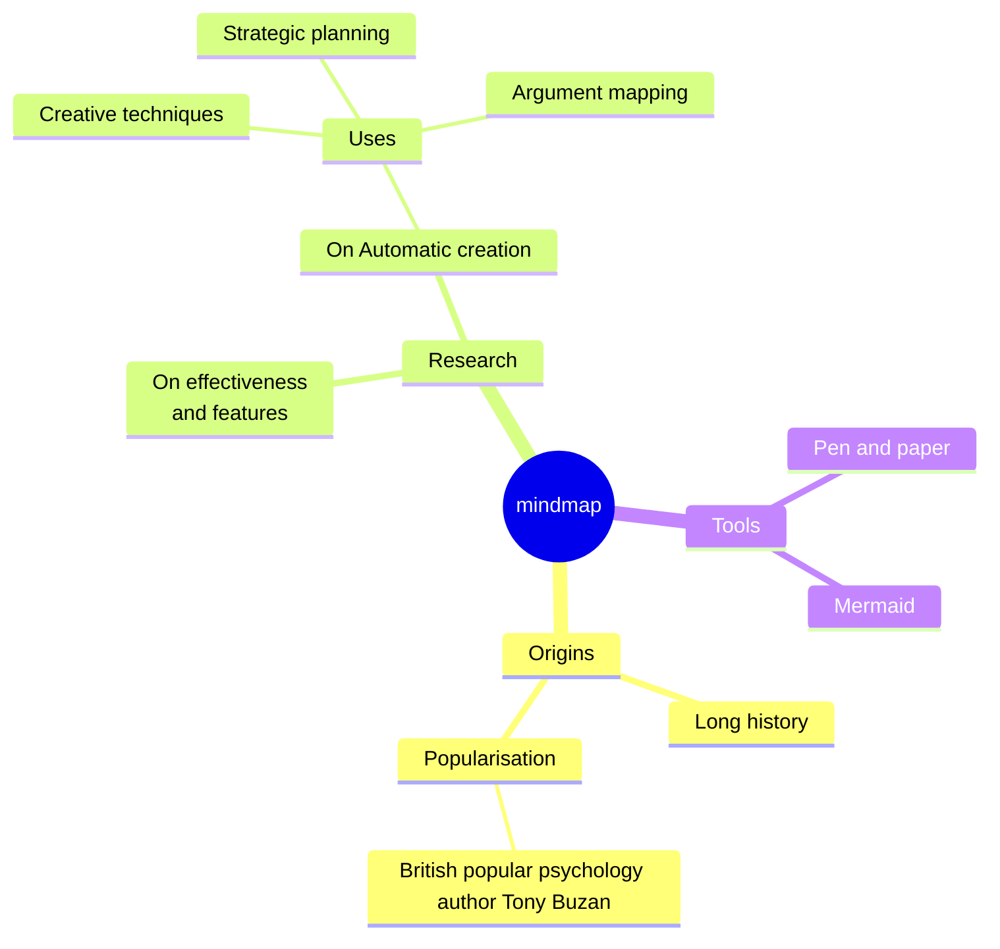
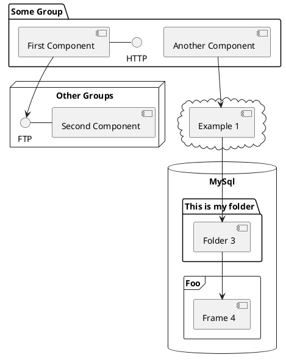

# Exploring Axios

## What Does This Library Do for Us?

<div class="mt-6">
<p>speaker：Monica</p>
<p>2025.5.20 @Langlive Tech Sharing</p>
</div>

<style>
  .slidev-page h1{
    @apply text-size-5xl;
  }
  .slidev-page h2{
    @apply text-light-700;
  }
  .slidev-layout p{
    margin-top: 0px;
    margin-bottom: 0.5rem;
    opacity: 0.6;
  }
</style>

---

```yaml
glowSeed: 15
glowOpacity: 0.3
```

# What is Axios?

- Promise based HTTP client for the browser and node.js
- Built-in many convenient features, such as request/response interceptors, error handling, request cancellation, etc.
<br>
<br>
<div my-10 w-min flex="~ gap-1" items-center justify-center>
  <mdi:github op50 ma text-xl />
  <a href="https://github.com/axios/axios" target="_blank" class="font-300 mr-4">axios</a>
  <mdi:file-document op50 ma text-xl/>
  <a href="https://github.com/axios/axios" target="_blank" class="font-300">axios</a>
</div>

---

# What is Axios?

Axios and Fetch

| Feature                   | axios | fetch                         |
| ------------------------- | ----- | ----------------------------- |
| Automatic JSON parsing    | ✅    | ❌ (requires `res.json()`)    |
| Request Interceptors      | ✅    | ❌                            |
| Response Interceptors     | ✅    | ❌                            |
| Automatic params handling | ✅    | ❌                            |
| Built-in error handling   | ✅    | ❌ (manual handling required) |

---

```yaml
layout: cover
```

# Basic Axios Usage

---

##### Basic Axios Usage
# Usage Examples

<div class='note-block'>
  This axios example and source code version uses v1.8.4
</div>

- Direct axios request
  - `axios(config)`
    ```js
    axios({
      method: 'get',
      url: 'https://jsonplaceholder.typicode.com/posts/1',
      headers: { 'X-Custom-Header': 'foobar' },
    });
    ```
  - `axios(url[, config])`
    ```js
    axios('https://jsonplaceholder.typicode.com/posts/1', {
      headers: { 'X-Custom-Header': 'foobar' },
    });
    ```
  - `axios.requestMethod`
    ```js
    axios.get('https://jsonplaceholder.typicode.com/posts/1');
    ```

---

##### Basic Axios Usage
# Usage Examples

- Create an axios instance for requests
  ```js
  const apiClient = axios.create({
    baseURL: 'https://jsonplaceholder.typicode.com',
    timeout: 5000,
    headers: { 'X-Custom-Header': 'foobar' },
  });
  apiClient.get('/posts/1').then((res) => console.log(res.data));
  ```

---

##### Basic Axios Usage
# 🔍 Source Code

### axios is exported in <a href='https://github.com/axios/axios/blob/v1.x/lib/axios.js' target='_blank' class='hover:text-[#c5c3fb]!'>lib/axios.js</a>

1. `createInstance`
<div class='ml-6'>

```js
function createInstance(defaultConfig) {
  const context = new Axios(defaultConfig); //  creates a new Axios instance
  const instance = bind(Axios.prototype.request, context); // creates a bound function using the bind method, This creates a function that will call Axios.prototype.request with the correct this context.

  // Copy axios.prototype to instance
  utils.extend(instance, Axios.prototype, context, { allOwnKeys: true });
  // Copy context to instance
  utils.extend(instance, context, null, { allOwnKeys: true });

  // Factory for creating new instances
  instance.create = function create(instanceConfig) {
    return createInstance(mergeConfig(defaultConfig, instanceConfig));
  };
  return instance; //  instance is both a function AND an object
}
```

</div>

---

##### Basic Axios Usage
# 🔍 Source Code

### axios is exported in <a href='https://github.com/axios/axios/blob/v1.x/lib/axios.js' target='_blank' class='hover:text-[#c5c3fb]!'>lib/axios.js</a>

1. `createInstance`
<div class='ml-6'>

`createInstance` function creates an Axios instance that functions both as a function and an object:

1. Creates a base `Axios` instance (context)
2. Binds `Axios.prototype.request` to context as the main request function
<div class='ml-6'>

- When calling `axios(config)`, it internally executes `Axios.prototype.request.bind(context)(config)`, making the main request function bound to the correct context
</div>

3. Extends instance to include:
<div class='ml-6'>

- Methods from Axios prototype chain (`get`, `post`, etc.)
- Configuration and state from context
</div>

4. Provides `create` method for new instances with merged custom configs

</div>

---

##### Basic Axios Usage
# 🔍 Source Code

### axios is exported in <a href='https://github.com/axios/axios/blob/v1.x/lib/axios.js' target='_blank' class='hover:text-[#c5c3fb]!'>lib/axios.js</a>

2. Create Default Axios Instance

<div class='ml-6'>

```js
const axios = createInstance(defaults);
```

- Creates an axios instance with default configuration, this is the instance we use directly

</div>

3. Extend Axios Instance with Additional Properties and Methods

<div class='ml-6'>

```js
// ...
axios.spread = spread;

// Expose isAxiosError
axios.isAxiosError = isAxiosError;

// Expose mergeConfig
axios.mergeConfig = mergeConfig;

axios.AxiosHeaders = AxiosHeaders;
// ..
```

</div>

---

##### Basic Axios Usage
# 🔍 Source Code

<br class='hidden' />

補充：從 [`index.d.ts`](https://github.com/axios/axios/blob/v1.x/index.d.ts) 看預設 axios instance 和 `axios.create` 回傳的 instance 差異

- Global axios is defined as `AxiosStatic`
<div class='ml-6'>

```js {*}{maxHeight:'250px'}
export interface AxiosStatic extends AxiosInstance {
  create(config?: CreateAxiosDefaults): AxiosInstance;
  Cancel: CancelStatic;
  CancelToken: CancelTokenStatic;
  Axios: typeof Axios;
  AxiosError: typeof AxiosError;
  HttpStatusCode: typeof HttpStatusCode;
  readonly VERSION: string;
  isCancel: typeof isCancel;
  all: typeof all;
  spread: typeof spread;
  isAxiosError: typeof isAxiosError;
  toFormData: typeof toFormData;
  formToJSON: typeof formToJSON;
  getAdapter: typeof getAdapter;
  CanceledError: typeof CanceledError;
  AxiosHeaders: typeof AxiosHeaders;
  mergeConfig: typeof mergeConfig;
}

declare const axios: AxiosStatic;
```

</div>

---

##### Basic Axios Usage
# 🔍 Source Code

<br class='hidden' />

補充：從 [`index.d.ts`](https://github.com/axios/axios/blob/v1.x/index.d.ts) 看預設 axios instance 和 `axios.create` 回傳的 instance 差異

- Instance returned by `axios.create` is defined as `AxiosInstance`

<div class='ml-6'>

```js
export interface AxiosInstance extends Axios {
  <T = any, R = AxiosResponse<T>, D = any>(config: AxiosRequestConfig<D>): Promise<R>;
  <T = any, R = AxiosResponse<T>, D = any>(url: string, config?: AxiosRequestConfig<D>): Promise<R>;

  defaults: Omit<AxiosDefaults, 'headers'> & {
    headers: HeadersDefaults & {
      [key: string]: AxiosHeaderValue
    }
  };
}
```

- `AxiosInstance` doesn't have methods like `isCancel()`, `isAxiosError()`, and can't access properties like `Cancel`, `CancelToken`, `HttpStatusCode`
  - `AxiosInstance` lacks the extension of the `axios` instance from step 3 above

</div>

---

##### Basic Axios Usage
# 🔍 Source Code

<br class='hidden' />

補充：從 [`index.d.ts`](https://github.com/axios/axios/blob/v1.x/index.d.ts) 看預設 axios instance 和 `axios.create` 回傳的 instance 差異

- Can an `axios.create` instance call `create` if `AxiosInstance` lacks this method?

  - In TypeScript type checking, using `AxiosInstance.create` will show an error
    
  - In JavaScript runtime, using `AxiosInstance.create` still works

    ```js
    const instance1 = axios.create({...});
    const instance2 = instance1.create({...});
    instance2.get('/posts/1').then((res) => console.log(res.data)); // Successfully prints data
    ```

    <div class='mt-2'/>

    > The `createInstance` called by `axios.create` assigns a function to `instance.create`

---

```yaml
layout: cover
```

# Axios URL Encoding

---

# Axios URL Encoding

- What does Axios do for us?
  - The `params` object is automatically converted to query strings
  - Uses [`encodeURIComponent`](https://developer.mozilla.org/en-US/docs/Web/JavaScript/Reference/Global_Objects/encodeURIComponent) for encoding by default
  - Supports [`paramsSerializer`](https://github.com/axios/axios?tab=readme-ov-file#request-config) for customization

---

##### Axios URL Encoding
# axios 與 fetch 範例

<div class="grid grid-cols-[140px_1fr_240px] gap-x-4 mt4">

<div />

###### code

###### console

<v-clicks :every='3'>

<div class="my-auto leading-6 text-base opacity-75">
axios: ParamsInUrl
</div>

```js
function axiosParamsInUrl() {
  const search = 'hello world!';
  const symbol = '&$';
  const response = await axios.get(
    `${API_URL}/url-encoded?search=${search}&symbol=${symbol}`
  );
  console.log(response.data);
}
```

```js
receivedQuery: {
  search: 'hello world!',
  symbol: '',
  $: ''
}
```

<div class="my-auto leading-6 text-base opacity-75">
axios: AutoEncodeParams
</div>

```js
function axiosAutoEncodeParams() {
  const search = 'hello world!';
  const symbol = '&$';
  const response = await axios.get(`${API_URL}/url-encoded`, {
    params: { search, symbol },
  });
  console.log(response.data);
}
```

```js
receivedQuery: {
  search: 'hello world!',
  symbol: '&$'
}
```

</v-clicks>

</div>

---

##### Axios URL Encoding
# axios 與 fetch 範例

<div class="grid grid-cols-[140px_1fr_240px] gap-x-4 mt4">

<div />

###### code

###### console

<v-clicks :every='3'>

<div class="my-auto leading-6 text-base opacity-75">
fetch: WithoutEncode
</div>

```js
function fetchWithoutEncode() {
  const search = 'hello world!';
  const symbol = '&$';
  const res = await fetch(
    `${API_URL}/url-encoded?search=${search}&symbol=${symbol}`
  );
  const data = await res.json();
  console.log(data);
}
```

```js
receivedQuery: {
  search: 'hello world!',
  symbol: '',
  $: ''
}
```

<div class="my-auto leading-6 text-base opacity-75">
fetch: ManualEncode
</div>

```js
function fetchManualEncode() {
  const search = 'hello world!';
  const symbol = '&$';
  const res = await fetch(
    `${API_URL}/url-encoded?search=${encodeURIComponent(
        search
      )}&symbol=${encodeURIComponent(symbol)}`
  );
  const data = await res.json();
  console.log(data);
}
```

```js
receivedQuery: {
  search: 'hello world!',
  symbol: '&$'
}
```

</v-clicks>

</div>

---

##### Axios URL Encoding
# 🔍 Source Code

<br class='hidden'/>

Axios URL encoding is implemented in [`lib/helpers/buildURL.js`](https://github.com/axios/axios/blob/v1.x/lib/helpers/buildURL.js)

### When does Axios call [`buildURL`](https://github.com/axios/axios/blob/v1.x/lib/helpers/buildURL.js)?

When you call `axios.get()`, here's what happens:

1. The request starts in the Axios class's` _request` method ([`lib/core/Axios.js`](https://github.com/axios/axios/blob/v1.x/lib/core/Axios.js)). This is the core method that handles all requests.
2. Inside `_request`, after handling interceptors, it calls `dispatchRequest` :
<div class='ml-6'>
```js {all|5}{maxHeight:'120px'}
// lib/core/Axios.js
_request(configOrUrl, config) {
    // ... 
    try {
      promise = dispatchRequest.call(this, newConfig);
    } catch (error) {
      return Promise.reject(error);
    }
    // ...
}
```
</div>

--- 


##### Axios URL Encoding
# 🔍 Source Code

### When does Axios call [`buildURL`](https://github.com/axios/axios/blob/v1.x/lib/helpers/buildURL.js)?
3. [`dispatchRequest`](https://github.com/axios/axios/blob/v1.x/lib/core/dispatchRequest.js) then gets the appropriate adapter (XHR for browsers, HTTP for Node.js) and calls it:

<div class='ml-6'>
```js {all|5}{maxHeight:'250px'}
// lib/core/dispatchRequest.js
export default function dispatchRequest(config) {
    // ...
    const adapter = adapters.getAdapter(config.adapter || defaults.adapter);
      return adapter(config).then(function onAdapterResolution(response) {
        throwIfCancellationRequested(config);
        // Transform response data
        response.data = transformData.call(
          config,
          config.transformResponse,
          response
        );
        response.headers = AxiosHeaders.from(response.headers);
        return response;
      }
    // ...
}
```
</div>

---

##### Axios URL Encoding
# 🔍 Source Code

### When does Axios call [`buildURL`](https://github.com/axios/axios/blob/v1.x/lib/helpers/buildURL.js)?
4. For browser environments, it uses the XHR adapter ([`lib/adapters/xhr.js`](https://github.com/axios/axios/blob/v1.x/lib/adapters/xhr.js)). The first thing the XHR adapter does is call `resolveConfig`


<div class='ml-6'>
```js {all|4}{maxHeight:'100px'}
// lib/adapters/xhr.js
function (config) {
  return new Promise(function dispatchXhrRequest(resolve, reject) {
    const _config = resolveConfig(config);
    // ...
});
}
```
</div>

5. [`resolveConfig`](https://github.com/axios/axios/blob/v1.x/lib/helpers/resolveConfig.js) is where the URL and params are processed. This is where your params get encoded:

<div class='ml-6'>
```js {all|4}{maxHeight:'100px'}
// lib/helpers/resolveConfig.js
export default (config) => {
// ...
    newConfig.url = buildURL(
      buildFullPath(newConfig.baseURL, newConfig.url, newConfig.allowAbsoluteUrls), 
      config.params, 
      config.paramsSerializer
    );
// ...
}
```
</div>


---

##### Axios URL Encoding
# 🔍 Source Code

### When does Axios call [`buildURL`](https://github.com/axios/axios/blob/v1.x/lib/helpers/buildURL.js)?

```js
axios.get()
    │
    ▼
Axios._request()
    │
    ▼
dispatchRequest()
    │
    ▼
xhrAdapter()
    │
    ▼
resolveConfig()
    │
    ▼
buildURL()  // This is where params are encoded
```

---

##### Axios URL Encoding
# 🔍 Source Code

### What does [`buildURL`](https://github.com/axios/axios/blob/v1.x/lib/helpers/buildURL.js) do?

- Purpose: takes a base URL and appends query parameters to it in a properly encoded format.
- Parameters:
    - `url`: The base URL (e.g., `"http://www.google.com"`)
    - `params`: An object containing the query parameters to append
    - `options`: Optional configuration for how to encode/serialize the parameters
        - Can be an object containing serialize function or encode function
        - Can also be directly passed as a serialize function

---

##### Axios URL Encoding
# 🔍 Source Code

### What does [`buildURL`](https://github.com/axios/axios/blob/v1.x/lib/helpers/buildURL.js) do?

```js {all|12-16|18|20-28|30-36|38-48|all}{maxHeight:'350px'}
/**
 * Build a URL by appending params to the end
 *
 * @param {string} url The base of the url (e.g., http://www.google.com)
 * @param {object} [params] The params to be appended
 * @param {?(object|Function)} options
 *
 * @returns {string} The formatted url
 */
export default function buildURL(url, params, options) {
  /*eslint no-param-reassign:0*/
  // If no parameters are provided, it returns the original URL unchanged.
  // This explains why parameters in axios.get(url) won't be encoded - they need to be in the params field of the axios config to be encoded.
  if (!params) { 
    return url;
  }

  const _encode = options && options.encode || encode; // Use options.encode if provided; otherwise use the built-in encode function

  if (utils.isFunction(options)) { // If options is passed as a function (e.g., custom serialize), it will be converted to { serialize: fn } format
    options = {
      serialize: options
    };
  } 

  const serializeFn = options && options.serialize;

  let serializedParams;

  if (serializeFn) {
    serializedParams = serializeFn(params, options); // If a custom serialize function is provided, use it to process params
  } else {
    serializedParams = utils.isURLSearchParams(params) ? // If params is a URLSearchParams instance, call .toString() directly - means developer has already transformed the params, axios doesn't need to process it
      params.toString() :
      new AxiosURLSearchParams(params, options).toString(_encode); // Use Axios's own AxiosURLSearchParams class to handle the params
  }

  if (serializedParams) { // If there are serialized parameters
    const hashmarkIndex = url.indexOf("#");
    if (hashmarkIndex !== -1) { // If # symbol is found, remove it and everything after it
      url = url.slice(0, hashmarkIndex);
    }
    // Decide whether to use ? or & to connect new parameters based on whether URL already has query parameters
    // For example, if url is https://example.com/search?type=user, use & to append additional parameters
    url += (url.indexOf('?') === -1 ? '?' : '&') + serializedParams;
  }

  return url;
}
```

---

##### Axios URL Encoding
# 🔍 Source Code

### What does [`AxiosURLSearchParams`](https://github.com/axios/axios/blob/v1.x/lib/helpers/AxiosURLSearchParams.js) do?
  - `AxiosURLSearchParams` is a custom class that handles the conversion of parameters into URL-encoded query strings

<div class='ml-6'>

```js {*}{maxHeight:'250px'}
/**
  * It takes a params object and converts it to a FormData object
  *
  * @param {Object<string, any>} params - The parameters to be converted to a FormData object.
  * @param {Object<string, any>} options - The options object passed to the Axios constructor.
  *
  * @returns {void}
  */
function AxiosURLSearchParams(params, options) {
  this._pairs = []; // Initialize key-value pairs
  params && toFormData(params, this, options); // 如果有 params 就呼叫 toFormData，toFormData 會呼叫 append 將 key-pairs 加入 _pairs 陣列
}

const prototype = AxiosURLSearchParams.prototype;

prototype.append = function append(name, value) { // 定義 append 方法，將新的 key-value pair 新增到內部的 pairs 陣列
  this._pairs.push([name, value]);
};

prototype.toString = function toString(encoder) { // 定義 toString 方法，將所有 pairs 轉換為 URL-encoded string
  const _encode = encoder ? function(value) { // 如果參數有指定 encoder，就回傳此 custom encoder， encoder.call(this, value, encode) 允許 custom encoder 存取要 encode 的 value 和 axios 預設的 encode function
    return encoder.call(this, value, encode); 
  } : encode; // 沒有指定 encoder，就使用預設 encode function

  return this._pairs.map(function each(pair) { // 遍歷 pairs 陣列，對每個 pair 操作：Encodes the key (pair[0])、Adds an equals sign (=)、Encodes the value (pair[1])，最後用 & 連接每個 encoded pairs
    return _encode(pair[0]) + '=' + _encode(pair[1]);
  }, '').join('&');
};
```
</div>


---

##### Axios URL Encoding
# 🔍 Source Code

### What does [`AxiosURLSearchParams`](https://github.com/axios/axios/blob/v1.x/lib/helpers/AxiosURLSearchParams.js) do?
  - axios default encode function

<div class='ml-6'>

```js{*}{maxHeight:'240px'}
/**
 * It encodes a string by replacing all characters that are not in the unreserved set with
 * their percent-encoded equivalents
 *
 * @param {string} str - The string to encode.
 *
 * @returns {string} The encoded string.
 */
function encode(str) {
  const charMap = {
    '!': '%21', // Exclamation mark may be interpreted as special commands on some servers
    "'": '%27', // Single quotes could lead to SQL injection or XSS attacks
    '(': '%28', // Parentheses have special meaning in some query languages
    ')': '%29',
    '~': '%7E', // Tilde is used to represent root directory in some systems
    '%20': '+', // Using + to represent spaces is a common convention in URL query parameters
    '%00': '\x00' // Null bytes need special handling to prevent security vulnerabilities
  };
  // Call encodeURIComponent for basic encoding, then use charMap for further processing of specific characters
  return encodeURIComponent(str).replace(/[!'()~]|%20|%00/g, function replacer(match) {
    return charMap[match];
  });
}
```

</div>

<div class='ml-6 text-sm opacity-[0.8]'>
The encoding results may differ between axios's encode function and native encodeURIComponent
</div>
---

##### Axios URL Encoding
# 🔍 Source Code

### What does [`AxiosURLSearchParams`](https://github.com/axios/axios/blob/v1.x/lib/helpers/AxiosURLSearchParams.js) do?
  - `AxiosURLSearchParams` example
    ```js
    const params = {
      name: 'John Doe',
      age: 30,
    };
    const serializedParams = new AxiosURLSearchParams(params).toString(_encode);
    // serializedParams will be "name=John+Doe&age=30"
    ```

---

##### Axios URL Encoding
# Supplement
### Astra apiClient
- `url.searchParams.append` 一樣會進行編碼 ✅
```js
const buildUrl = (endpoint: string, params?: Record<string, unknown>): string => {
  // ...

  const url = new URL(path, baseUrl)

  // add query params
  if (params) {
    Object.entries(params).forEach(([key, value]) => {
      if (value !== undefined && value !== null) {
        url.searchParams.append(key, String(value))
      }
    })
  }
  return url.toString()
}
```

---

##### Axios URL Encoding
# Supplement
### What does [`isURLSearchParams`](https://github.com/axios/axios/blob/v1.x/lib/utils.js) do?
```js {*}{maxHeight:'150px'}
// lib/utils.js
/**
 * Determine if a value is a URLSearchParams object
 *
 * @param {*} val The value to test
 *
 * @returns {boolean} True if value is a URLSearchParams object, otherwise false
 */
const isURLSearchParams = kindOfTest('URLSearchParams');
```

  - `kindOfTest`: returns a function that checks for a specific type
    ```js
    // lib/utils.js
    const kindOfTest = (type) => {
      type = type.toLowerCase();
      return (thing) => kindOf(thing) === type // 回傳一個函式，若 type 是 URLSearchParams，則此函式最終會檢查一個值(thing)是否是 URLSearchParams 類型的 instance
    }
    ```


---

##### Axios URL Encoding
# Supplement
### What does [`isURLSearchParams`](https://github.com/axios/axios/blob/v1.x/lib/utils.js) do?
- `kindOf`: logic to check if it's an instance of a specific type
  ```js
  const {toString} = Object.prototype;
  const kindOf = (cache => thing => {
      const str = toString.call(thing);
      return cache[str] || (cache[str] = str.slice(8, -1).toLowerCase());
  })(Object.create(null));
  ```
  - `Object.prototype.toString` 被調用在一個物件上時，會回傳 `[object Type]` 格式的字串
    - 對於 `URLSearchParams` 物件，會回傳 `[object URLSearchParams]`
  - `str.slice(8, -1)` 會去掉 `[object ` 和最後的 `]`，得到 Type
    - `[object URLSearchParams]` 會變成 `URLSearchParams`
  - 以 `Object.create(null)` 建立一個純淨的物件作為緩存


---

##### Axios URL Encoding
# Supplement
### What does [`isURLSearchParams`](https://github.com/axios/axios/blob/v1.x/lib/utils.js) do?
- `isURLSearchParams` 實際呼叫流程
  ```js
  const params = new URLSearchParams();
  isURLSearchParams(params);

  // 內部發生的過程：
  // 1. toString.call(params) 回傳 "[object URLSearchParams]"
  // 2. slice(8, -1) 得到 "URLSearchParams"
  // 3. toLowerCase() 得到 "urlsearchparams"
  // 4. 與傳入的 type 比較，返回 true
  ```


---

##### Axios URL Encoding
# Supplement
### What does [`isURLSearchParams`](https://github.com/axios/axios/blob/v1.x/lib/utils.js) do?
Q1: 為什麼 `kindOf` 是用 `Object.prototype.toString.call()` 而不是 `Object.prototype.toString()`?
  - 直接呼叫 `object.toString()` 時，大多數物件都會覆蓋繼承自 `Object.prototype` 的 `toString` 方法
    ```js
    const arr = [1, 2, 3];
    arr.toString()  // 回傳 "1,2,3"

    const date = new Date();
    date.toString()  // 回傳像 "Mon Jan 01 2024 12:00:00 GMT+0800" 這樣的字串
    ```
---

##### Axios URL Encoding
# Supplement
### What does [`isURLSearchParams`](https://github.com/axios/axios/blob/v1.x/lib/utils.js) do?
Q1: 為什麼 `kindOf` 是用 `Object.prototype.toString.call()` 而不是 `Object.prototype.toString()`?
  - `Object.prototype.toString` 的原始實現會回傳物件的內部 `[[Class]]` 屬性
    - `call` 方法可強制在任何值上使用原始的 `toString` 實現
<div class='ml-12'>
  <div class='quote mb-2'>
    To use the base Object.prototype.toString() with an object that has it overridden (or to invoke it on null or undefined), you need to call Function.prototype.call() or Function.prototype.apply() on it, passing the object you want to inspect as the first parameter (called thisArg). (ref: <a href='https://developer.mozilla.org/en-US/docs/Web/JavaScript/Reference/Global_Objects/Object/toString' target='_blank'>Object.prototype.toString()</a>)
  </div>

```js
// 使用 call
Object.prototype.toString.call([1, 2, 3])     // "[object Array]"
Object.prototype.toString.call(new Date())    // "[object Date]"

// 直接調用 toString
[1, 2, 3].toString()      // "1,2,3"
new Date().toString()     // "Mon Jan 01 2024 12:00:00 GMT+0800"
```
</div>


---

##### Axios URL Encoding
# Supplement
### What does [`isURLSearchParams`](https://github.com/axios/axios/blob/v1.x/lib/utils.js) do?
Q2: 為什麼 `kindOf` 要用 `Object.prototype.toString.call()` 而不是 `instanceof`?
  - 跨域（Cross-realm）支援
    ```js
    // 在 iframe 情境
    const iframe = document.createElement('iframe');
    document.body.appendChild(iframe);
    const iframeArray = iframe.contentWindow.Array;
    const arr = new iframeArray();

    // Object.prototype.toString.call()
    toString.call(arr)  // '[object Array]' → 正確識別

    // instanceof
    arr instanceof Array  // false → 無法正確識別跨域物件
    ```


---

##### Axios URL Encoding
# Supplement
### What does [`isURLSearchParams`](https://github.com/axios/axios/blob/v1.x/lib/utils.js) do?
Q2: 為什麼 `kindOf` 要用 `Object.prototype.toString.call()` 而不是 `instanceof`?
  - 原始型別（Primitives）處理
    ```js
    // Object.prototype.toString.call()
    toString.call('string')  // '[object String]'
    toString.call(123)      // '[object Number]'
    toString.call(true)     // '[object Boolean]'

    // instanceof
    'string' instanceof String  // false
    123 instanceof Number      // false
    true instanceof Boolean    // false
    ```

---

##### Axios URL Encoding
# Supplement
### What does [`isURLSearchParams`](https://github.com/axios/axios/blob/v1.x/lib/utils.js) do?
Q2: 為什麼 `kindOf` 要用 `Object.prototype.toString.call()` 而不是 `instanceof`?
  - `null` 和 `undefined` 處理
    ```js
    // Object.prototype.toString.call()
    toString.call(null)      // '[object Null]'
    toString.call(undefined) // '[object Undefined]'

    // instanceof
    null instanceof Object    // false
    undefined instanceof Object // false
    ```

---

##### Axios URL Encoding
# Supplement
### What does [`isURLSearchParams`](https://github.com/axios/axios/blob/v1.x/lib/utils.js) do?
Q2: 為什麼 `kindOf` 要用 `Object.prototype.toString.call()` 而不是 `instanceof`?
<div class='ml-6'>

使用 `toString.call(thing)` 可保證一致性行為：
- 跨不同執行環境有一致的行為
- 不受原型鏈影響
- 對內建型別有可靠的檢查

</div>


---

##### Axios URL Encoding
# Supplement
### What does [`isURLSearchParams`](https://github.com/axios/axios/blob/v1.x/lib/utils.js) do?
Q3: 如果只需檢查 FormData、Blob 和 ArrayBuffer，`toString.call(thing)` 和 `instanceof` 有差異嗎？
  - 對於這三種特定類型，兩種方法的差異較小
    ```js
    // 兩種方法都可行
    const formData = new FormData();
    const blob = new Blob([]);
    const arrayBuffer = new ArrayBuffer(8);

    // 方法 1: Object.prototype.toString.call()
    toString.call(formData)    // '[object FormData]'
    toString.call(blob)        // '[object Blob]'
    toString.call(arrayBuffer) // '[object ArrayBuffer]'

    // 方法 2: instanceof
    formData instanceof FormData       // true
    blob instanceof Blob               // true
    arrayBuffer instanceof ArrayBuffer // true
    ```

---

##### Axios URL Encoding
# Supplement
### What does [`isURLSearchParams`](https://github.com/axios/axios/blob/v1.x/lib/utils.js) do?
Q3: 如果只需檢查 FormData、Blob 和 ArrayBuffer，`toString.call(thing)` 和 `instanceof` 有差異嗎？
- 差異較小的原因
  - 都是建構函式建立的實例（不是原始型別）
  - 都是內建型別
  - 一般使用時較少跨域情境

---

##### Axios URL Encoding
# Supplement
### What does [`isURLSearchParams`](https://github.com/axios/axios/blob/v1.x/lib/utils.js) do?
Q3: 如果只需檢查 FormData、Blob 和 ArrayBuffer，`toString.call(thing)` 和 `instanceof` 有差異嗎？
- 唯一主要差異：跨域情境
  ```js
  // 在 iframe 中
  const iframe = document.createElement('iframe');
  document.body.appendChild(iframe);
  const iframeFormData = new iframe.contentWindow.FormData();

  // Object.prototype.toString.call() - 可運作 ✅
  toString.call(iframeFormData) === '[object FormData]'  // true

  // instanceof - 可能失敗 🔺
  iframeFormData instanceof FormData  // 在某些瀏覽器中會是 false
  ```
---

##### Axios URL Encoding
# Supplement
### What does [`isURLSearchParams`](https://github.com/axios/axios/blob/v1.x/lib/utils.js) do?
Q3: 如果只需檢查 FormData、Blob 和 ArrayBuffer，`toString.call(thing)` 和 `instanceof` 有差異嗎？

- 如果是框架/函式庫開發：`Object.prototype.toString.call()` 更安全
- 如果是一般應用開發：這三種類型用 `instanceof` 就足夠


---

```yaml
layout: quote
```

##### Axios URL Encoding
# Summary

<br class='hidden' />


When we call request functions like `axios.get`, Axios uses `buildURL` to combine the base URL and params object into a complete URL. It properly handles parameter encoding, removes anchors (`#`), processes existing query parameters (`?`), ensuring the generated URL is correctly formatted and secure


---

```yaml
layout: cover
```

# Axios Request and Response Transformation


---

# Axios Request and Response Transformation

- What does Axios do for us?
  - Request transformation (`transformRequest`)
    - Executes before sending the request, e.g., automatic `JSON.stringify(data)`
  - Response transformation (`transformResponse`)
    - Executes when response is received, e.g., automatic `JSON.parse(response.data)`
  - Custom `transformRequest` or `transformResponse` functions can be passed through [config](https://axios-http.com/docs/req_config)


---

##### Axios Request and Response Transformation


  


---

# Code

Use code snippets and get the highlighting directly, and even types hover!

```ts {all|5|7|7-8|10|all} twoslash
// TwoSlash enables TypeScript hover information
// and errors in markdown code blocks
// More at https://shiki.style/packages/twoslash

import { computed, ref } from 'vue';

const count = ref(0);
const doubled = computed(() => count.value * 2);

doubled.value = 2;
```

<arrow v-click="[4, 5]" x1="350" y1="310" x2="195" y2="334" color="#953" width="2" arrowSize="1" />

<!-- This allow you to embed external code blocks -->

<<< @/snippets/external.ts#snippet

<!-- Footer -->

[Learn more](https://sli.dev/features/line-highlighting)

<!-- Inline style -->
<style>
.footnotes-sep {
  @apply mt-5 opacity-10;
}
.footnotes {
  @apply text-sm opacity-75;
}
.footnote-backref {
  display: none;
}
</style>

<!--
Notes can also sync with clicks

[click] This will be highlighted after the first click

[click] Highlighted with `count = ref(0)`

[click:3] Last click (skip two clicks)
-->

---

## level: 2

# Shiki Magic Move

Powered by [shiki-magic-move](https://shiki-magic-move.netlify.app/), Slidev supports animations across multiple code snippets.

Add multiple code blocks and wrap them with <code>````md magic-move</code> (four backticks) to enable the magic move. For example:

````md magic-move {lines: true}
```ts {*|2|*}
// step 1
const author = reactive({
  name: 'John Doe',
  books: [
    'Vue 2 - Advanced Guide',
    'Vue 3 - Basic Guide',
    'Vue 4 - The Mystery',
  ],
});
```

```ts {*|1-2|3-4|3-4,8}
// step 2
export default {
  data() {
    return {
      author: {
        name: 'John Doe',
        books: [
          'Vue 2 - Advanced Guide',
          'Vue 3 - Basic Guide',
          'Vue 4 - The Mystery',
        ],
      },
    };
  },
};
```

```ts
// step 3
export default {
  data: () => ({
    author: {
      name: 'John Doe',
      books: [
        'Vue 2 - Advanced Guide',
        'Vue 3 - Basic Guide',
        'Vue 4 - The Mystery',
      ],
    },
  }),
};
```

Non-code blocks are ignored.

```vue
<!-- step 4 -->
<script setup>
const author = {
  name: 'John Doe',
  books: [
    'Vue 2 - Advanced Guide',
    'Vue 3 - Basic Guide',
    'Vue 4 - The Mystery',
  ],
};
</script>
```
````

---

# Components

<div grid="~ cols-2 gap-4">
<div>

You can use Vue components directly inside your slides.

We have provided a few built-in components like `<Tweet/>` and `<Youtube/>` that you can use directly. And adding your custom components is also super easy.

```html
<Counter :count="10" />
```

<!-- ./components/Counter.vue -->
<Counter :count="10" m="t-4" />

Check out [the guides](https://sli.dev/builtin/components.html) for more.

</div>
<div>

```html
<Tweet id="1390115482657726468" />
```

<Tweet id="1390115482657726468" scale="0.65" />

</div>
</div>

<!--
Presenter note with **bold**, *italic*, and ~~striked~~ text.

Also, HTML elements are valid:
<div class="flex w-full">
  <span style="flex-grow: 1;">Left content</span>
  <span>Right content</span>
</div>
-->

---

## class: px-20

# Themes

Slidev comes with powerful theming support. Themes can provide styles, layouts, components, or even configurations for tools. Switching between themes by just **one edit** in your frontmatter:

<div grid="~ cols-2 gap-2" m="t-2">

```yaml
---
theme: default
---
```

```yaml
---
theme: seriph
---
```


</div>

Read more about [How to use a theme](https://sli.dev/guide/theme-addon#use-theme) and
check out the [Awesome Themes Gallery](https://sli.dev/resources/theme-gallery).

---

# Clicks Animations

You can add `v-click` to elements to add a click animation.

<div v-click>

This shows up when you click the slide:

```html
<div v-click>This shows up when you click the slide.</div>
```

</div>

<br>

<v-click>

The <span v-mark.red="3"><code>v-mark</code> directive</span>
also allows you to add
<span v-mark.circle.orange="4">inline marks</span>
, powered by [Rough Notation](https://roughnotation.com/):

```html
<span v-mark.underline.orange>inline markers</span>
```

</v-click>

<div mt-20 v-click>

[Learn more](https://sli.dev/guide/animations#click-animation)

</div>

---

# Motions

Motion animations are powered by [@vueuse/motion](https://motion.vueuse.org/), triggered by `v-motion` directive.

```html
<div
  v-motion
  :initial="{ x: -80 }"
  :enter="{ x: 0 }"
  :click-3="{ x: 80 }"
  :leave="{ x: 1000 }"
>
  Slidev
</div>
```

<div class="w-60 relative">
  <div class="relative w-40 h-40">
    
    
    
  </div>

  <div
    class="text-5xl absolute top-14 left-40 text-[#2B90B6] -z-1"
    v-motion
    :initial="{ x: -80, opacity: 0}"
    :enter="{ x: 0, opacity: 1, transition: { delay: 2000, duration: 1000 } }">
    Slidev
  </div>
</div>

<!-- vue script setup scripts can be directly used in markdown, and will only affects current page -->
<script setup lang="ts">
const final = {
  x: 0,
  y: 0,
  rotate: 0,
  scale: 1,
  transition: {
    type: 'spring',
    damping: 10,
    stiffness: 20,
    mass: 2
  }
}
</script>

<div
  v-motion
  :initial="{ x:35, y: 30, opacity: 0}"
  :enter="{ y: 0, opacity: 1, transition: { delay: 3500 } }">

[Learn more](https://sli.dev/guide/animations.html#motion)

</div>

---

# LaTeX

LaTeX is supported out-of-box. Powered by [KaTeX](https://katex.org/).

<div h-3 />

Inline $\sqrt{3x-1}+(1+x)^2$

Block

$$
{1|3|all}
\begin{aligned}
\nabla \cdot \vec{E} &= \frac{\rho}{\varepsilon_0} \\
\nabla \cdot \vec{B} &= 0 \\
\nabla \times \vec{E} &= -\frac{\partial\vec{B}}{\partial t} \\
\nabla \times \vec{B} &= \mu_0\vec{J} + \mu_0\varepsilon_0\frac{\partial\vec{E}}{\partial t}
\end{aligned}
$$

[Learn more](https://sli.dev/features/latex)

---

# Diagrams

You can create diagrams / graphs from textual descriptions, directly in your Markdown.

<div class="grid grid-cols-4 gap-5 pt-4 -mb-6">









</div>

Learn more: [Mermaid Diagrams](https://sli.dev/features/mermaid) and [PlantUML Diagrams](https://sli.dev/features/plantuml)

---

foo: bar
dragPos:
square: 691,32,167,\_,-16

---

dragPos:
square: -114,0,0,0

---

dragPos:
square: -114,0,0,0

---

dragPos:
square: -114,0,0,0

---

dragPos:
square: -114,0,0,0

---

dragPos:
square: -114,0,0,0

---

dragPos:
square: -114,0,0,0

---

dragPos:
square: -114,0,0,0

---

dragPos:
square: -114,0,0,0

---

dragPos:
square: -114,0,0,0

---

dragPos:
square: -114,0,0,0

---

dragPos:
square: -114,0,0,0

---

dragPos:
square: -114,0,0,0

---

dragPos:
square: -114,0,0,0

---

dragPos:
square: -114,0,0,0

---

dragPos:
square: -114,0,0,0

---

dragPos:
square: -114,0,0,0

---

dragPos:
square: -114,0,0,0

---

dragPos:
square: -114,0,0,0

---

dragPos:
square: -114,0,0,0

---

dragPos:
square: -114,0,0,0

---

dragPos:
square: -114,0,0,0

---

dragPos:
square: -114,0,0,0

---

dragPos:
square: -114,0,0,0

---

dragPos:
square: -114,0,0,0

---

dragPos:
square: -114,0,0,0

---

dragPos:
square: -114,0,0,0

---

dragPos:
square: -114,0,0,0

---

dragPos:
square: -114,0,0,0

---

dragPos:
square: -114,0,0,0

---

dragPos:
square: -114,0,0,0

---

dragPos:
square: -114,0,0,0

---

dragPos:
square: -114,0,0,0

---

dragPos:
square: -114,0,0,0

---

dragPos:
square: -114,0,0,0

---

dragPos:
square: -114,0,0,0

---

dragPos:
square: -114,0,0,0

---

dragPos:
square: -114,0,0,0

---

dragPos:
square: -114,0,0,0

---

dragPos:
square: -114,0,0,0

---

dragPos:
square: -114,0,0,0

---

dragPos:
square: -114,0,0,0

---

dragPos:
square: -114,0,0,0

---

dragPos:
square: -114,0,0,0

---

dragPos:
square: -114,0,0,0

---

dragPos:
square: -114,0,0,0

---

dragPos:
square: -114,0,0,0

---

dragPos:
square: -114,0,0,0

---

dragPos:
square: -114,0,0,0

---

dragPos:
square: -114,0,0,0

---

dragPos:
square: -114,0,0,0

---

dragPos:
square: -114,0,0,0

---

dragPos:
square: -114,0,0,0

---

dragPos:
square: -114,0,0,0

---

dragPos:
square: -114,0,0,0

---

dragPos:
square: -114,0,0,0

---

dragPos:
square: -114,0,0,0

---

dragPos:
square: -114,0,0,0

---

dragPos:
square: -114,0,0,0

---

dragPos:
square: -114,0,0,0

---

dragPos:
square: -114,0,0,0

---

dragPos:
square: -114,0,0,0

---

dragPos:
square: -114,0,0,0

---

dragPos:
square: -114,0,0,0

---

dragPos:
square: -114,0,0,0

---

dragPos:
square: -114,0,0,0

---

dragPos:
square: -114,0,0,0

---

dragPos:
square: -114,0,0,0

---

dragPos:
square: -114,0,0,0

---

dragPos:
square: -114,0,0,0

---

dragPos:
square: -114,0,0,0

---

dragPos:
square: -114,0,0,0

---

dragPos:
square: -114,0,0,0

---

dragPos:
square: -114,0,0,0

---

dragPos:
square: -114,0,0,0

---

dragPos:
square: -114,0,0,0

---

dragPos:
square: -114,0,0,0

---

dragPos:
square: -114,0,0,0

---

dragPos:
square: -114,0,0,0

---

dragPos:
square: -114,0,0,0

---

dragPos:
square: -114,0,0,0

---

dragPos:
square: -114,0,0,0

---

dragPos:
square: -114,0,0,0

---

dragPos:
square: -114,0,0,0

---

dragPos:
square: -114,0,0,0

---

dragPos:
square: -114,0,0,0

---

dragPos:
square: -114,0,0,0

---

dragPos:
square: -114,0,0,0

---

dragPos:
square: -114,0,0,0

---

dragPos:
square: -114,0,0,0

---

dragPos:
square: -114,0,0,0

---

dragPos:
square: -114,0,0,0

---

dragPos:
square: -114,0,0,0

---

dragPos:
square: -114,0,0,0

---

dragPos:
square: -114,0,0,0

---

dragPos:
square: -114,0,0,0

---

dragPos:
square: -114,0,0,0

---

dragPos:
square: -114,0,0,0

---

dragPos:
square: -114,0,0,0

---

dragPos:
square: -114,0,0,0

---

dragPos:
square: -114,0,0,0

---

dragPos:
square: -114,0,0,0

---

dragPos:
square: -114,0,0,0

---

dragPos:
square: -114,0,0,0

---

dragPos:
square: -114,0,0,0

---

dragPos:
square: -114,0,0,0

---

dragPos:
square: -114,0,0,0

---

dragPos:
square: -114,0,0,0

---

dragPos:
square: -114,0,0,0

---

dragPos:
square: -114,0,0,0

---

dragPos:
square: -114,0,0,0

---

dragPos:
square: -114,0,0,0

---

dragPos:
square: -114,0,0,0

---

dragPos:
square: -114,0,0,0

---

dragPos:
square: -114,0,0,0

---

dragPos:
square: -114,0,0,0

---

dragPos:
square: -114,0,0,0

---

dragPos:
square: -114,0,0,0

---

dragPos:
square: -114,0,0,0

---

dragPos:
square: -114,0,0,0

---

dragPos:
square: -114,0,0,0

---

dragPos:
square: -114,0,0,0

---

dragPos:
square: -114,0,0,0

---

dragPos:
square: -114,0,0,0

---

dragPos:
square: -114,0,0,0

---

dragPos:
square: -114,0,0,0

---

dragPos:
square: -114,0,0,0

---

dragPos:
square: -114,0,0,0

---

dragPos:
square: -114,0,0,0

---

dragPos:
square: -114,0,0,0

---

dragPos:
square: -114,0,0,0

---

dragPos:
square: -114,0,0,0

---

dragPos:
square: -114,0,0,0

---

dragPos:
square: -114,0,0,0

---

dragPos:
square: -114,0,0,0

---

dragPos:
square: -114,0,0,0

---

dragPos:
square: -114,0,0,0

---

dragPos:
square: -114,0,0,0

---

dragPos:
square: -114,0,0,0

---

dragPos:
square: -114,0,0,0

---

dragPos:
square: -114,0,0,0

---

dragPos:
square: -114,0,0,0

---

dragPos:
square: -114,0,0,0

---

dragPos:
square: -114,0,0,0

---

dragPos:
square: -114,0,0,0

---

dragPos:
square: -114,0,0,0

---

dragPos:
square: -114,0,0,0

---

dragPos:
square: -114,0,0,0

---

dragPos:
square: -114,0,0,0

---

dragPos:
square: -114,0,0,0

---

dragPos:
square: -114,0,0,0

---

dragPos:
square: -114,0,0,0

---

dragPos:
square: -114,0,0,0

---

dragPos:
square: -114,0,0,0

---

dragPos:
square: -114,0,0,0

---

dragPos:
square: -114,0,0,0

---

dragPos:
square: -114,0,0,0

---

dragPos:
square: -114,0,0,0

---

dragPos:
square: -114,0,0,0

---

dragPos:
square: -114,0,0,0

---

dragPos:
square: -114,0,0,0

---

dragPos:
square: -114,0,0,0

---

dragPos:
square: -114,0,0,0

---

dragPos:
square: -114,0,0,0

---

dragPos:
square: -114,0,0,0

---

dragPos:
square: -114,0,0,0

---

dragPos:
square: -114,0,0,0

---

dragPos:
square: -114,0,0,0

---

dragPos:
square: -114,0,0,0

---

dragPos:
square: -114,0,0,0

---

dragPos:
square: -114,0,0,0

---

dragPos:
square: -114,0,0,0

---

dragPos:
square: -114,0,0,0

---

dragPos:
square: -114,0,0,0

---

dragPos:
square: -114,0,0,0

---

dragPos:
square: -114,0,0,0

---

dragPos:
square: -114,0,0,0

---

dragPos:
square: -114,0,0,0

---

dragPos:
square: -114,0,0,0

---

dragPos:
square: -114,0,0,0

---

dragPos:
square: -114,0,0,0

---

dragPos:
square: -114,0,0,0

---

dragPos:
square: -114,0,0,0

---

dragPos:
square: -114,0,0,0

---

dragPos:
square: -114,0,0,0

---

dragPos:
square: -114,0,0,0

---

dragPos:
square: -114,0,0,0

---

dragPos:
square: -114,0,0,0

---

dragPos:
square: -114,0,0,0

---

dragPos:
square: -114,0,0,0

---

dragPos:
square: -114,0,0,0

---

dragPos:
square: -114,0,0,0

---

dragPos:
square: -114,0,0,0

---

dragPos:
square: -114,0,0,0

---

dragPos:
square: -114,0,0,0

---

dragPos:
square: -114,0,0,0

---

dragPos:
square: -114,0,0,0

---

dragPos:
square: -114,0,0,0

---

dragPos:
square: -114,0,0,0

---

dragPos:
square: -114,0,0,0

---

dragPos:
square: -114,0,0,0

---

dragPos:
square: -114,0,0,0

---

dragPos:
square: -114,0,0,0

---

dragPos:
square: -114,0,0,0

---

dragPos:
square: -114,0,0,0

---

dragPos:
square: -114,0,0,0

---

dragPos:
square: -114,0,0,0

---

dragPos:
square: -114,0,0,0

---

dragPos:
square: -114,0,0,0

---

dragPos:
square: -114,0,0,0

---

dragPos:
square: -114,0,0,0

---

dragPos:
square: -114,0,0,0

---

dragPos:
square: -114,0,0,0

---

dragPos:
square: -114,0,0,0

---

dragPos:
square: -114,0,0,0

---

dragPos:
square: -114,0,0,0

---

dragPos:
square: -114,0,0,0

---

dragPos:
square: -114,0,0,0

---

dragPos:
square: -114,0,0,0

---

dragPos:
square: -114,0,0,0

---

dragPos:
square: -114,0,0,0

---

dragPos:
square: -114,0,0,0

---

dragPos:
square: -114,0,0,0

---

dragPos:
square: -114,0,0,0

---

dragPos:
square: -114,0,0,0

---

dragPos:
square: -114,0,0,0

---

dragPos:
square: -114,0,0,0

---

dragPos:
square: -114,0,0,0

---

dragPos:
square: -114,0,0,0

---

dragPos:
square: -114,0,0,0

---

dragPos:
square: -114,0,0,0

---

dragPos:
square: -114,0,0,0

---

dragPos:
square: -114,0,0,0

---

dragPos:
square: -114,0,0,0

---

dragPos:
square: -114,0,0,0

---

dragPos:
square: -114,0,0,0

---

dragPos:
square: -114,0,0,0

---

dragPos:
square: -114,0,0,0

---

dragPos:
square: -114,0,0,0

---

dragPos:
square: -114,0,0,0

---

dragPos:
square: -114,0,0,0

---

dragPos:
square: -114,0,0,0

---

dragPos:
square: -114,0,0,0

---

dragPos:
square: -114,0,0,0

---

dragPos:
square: -114,0,0,0

---

dragPos:
square: -114,0,0,0

---

dragPos:
square: -114,0,0,0

---

dragPos:
square: -114,0,0,0

---

dragPos:
square: -114,0,0,0

---

dragPos:
square: -114,0,0,0

---

dragPos:
square: -114,0,0,0

---

dragPos:
square: -114,0,0,0

---

dragPos:
square: -114,0,0,0

---

dragPos:
square: -114,0,0,0

---

dragPos:
square: -114,0,0,0

---

dragPos:
square: -114,0,0,0

---

dragPos:
square: -114,0,0,0

---

dragPos:
square: -114,0,0,0

---

dragPos:
square: -114,0,0,0

---

dragPos:
square: -114,0,0,0

---

dragPos:
square: -114,0,0,0

---

dragPos:
square: -114,0,0,0

---

dragPos:
square: -114,0,0,0

---

dragPos:
square: -114,0,0,0

---

dragPos:
square: -114,0,0,0

---

dragPos:
square: -114,0,0,0

---

dragPos:
square: -114,0,0,0

---

dragPos:
square: -114,0,0,0

---

dragPos:
square: -114,0,0,0

---

dragPos:
square: -114,0,0,0

---

dragPos:
square: -114,0,0,0

---

dragPos:
square: -114,0,0,0

---

dragPos:
square: -114,0,0,0

---

dragPos:
square: -114,0,0,0

---

dragPos:
square: -114,0,0,0

---

dragPos:
square: -114,0,0,0

---

dragPos:
square: -114,0,0,0

---

dragPos:
square: -114,0,0,0

---

dragPos:
square: -114,0,0,0

---

dragPos:
square: -114,0,0,0

---

dragPos:
square: -114,0,0,0

---

dragPos:
square: -114,0,0,0

---

dragPos:
square: -114,0,0,0

---

dragPos:
square: -114,0,0,0

---

dragPos:
square: -114,0,0,0

---

dragPos:
square: -114,0,0,0

---

dragPos:
square: -114,0,0,0

---

dragPos:
square: -114,0,0,0

---

dragPos:
square: -114,0,0,0

---

dragPos:
square: -114,0,0,0

---

dragPos:
square: -114,0,0,0

---

dragPos:
square: -114,0,0,0

---

dragPos:
square: -114,0,0,0

---

dragPos:
square: -114,0,0,0

---

dragPos:
square: -114,0,0,0

---

dragPos:
square: -114,0,0,0

---

dragPos:
square: -114,0,0,0

---

dragPos:
square: -114,0,0,0

---

dragPos:
square: -114,0,0,0

---

dragPos:
square: -114,0,0,0

---

dragPos:
square: -114,0,0,0

---

dragPos:
square: -114,0,0,0

---

dragPos:
square: -114,0,0,0

---

dragPos:
square: -114,0,0,0

---

dragPos:
square: -114,0,0,0

---

dragPos:
square: -114,0,0,0

---

dragPos:
square: -114,0,0,0

---

dragPos:
square: -114,0,0,0

---

dragPos:
square: -114,0,0,0

---

dragPos:
square: -114,0,0,0

---

dragPos:
square: -114,0,0,0

---

dragPos:
square: -114,0,0,0

---

dragPos:
square: -114,0,0,0

---

dragPos:
square: -114,0,0,0

---

dragPos:
square: -114,0,0,0

---

dragPos:
square: -114,0,0,0

---

dragPos:
square: -114,0,0,0

---

dragPos:
square: -114,0,0,0

---

dragPos:
square: -114,0,0,0

---

dragPos:
square: -114,0,0,0

---

dragPos:
square: -114,0,0,0

---

dragPos:
square: -114,0,0,0

---

dragPos:
square: -114,0,0,0

---

dragPos:
square: -114,0,0,0

---

dragPos:
square: -114,0,0,0

---

dragPos:
square: -114,0,0,0

---

dragPos:
square: -114,0,0,0

---

dragPos:
square: -114,0,0,0

---

dragPos:
square: -114,0,0,0

---

dragPos:
square: -114,0,0,0

---

dragPos:
square: -114,0,0,0

---

dragPos:
square: -114,0,0,0

---

dragPos:
square: -114,0,0,0

---

dragPos:
square: -114,0,0,0

---

dragPos:
square: -114,0,0,0

---

dragPos:
square: -114,0,0,0

---

dragPos:
square: -114,0,0,0

---

dragPos:
square: -114,0,0,0

---

dragPos:
square: -114,0,0,0

---

dragPos:
square: -114,0,0,0

---

dragPos:
square: -114,0,0,0

---

dragPos:
square: -114,0,0,0

---

dragPos:
square: -114,0,0,0

---

dragPos:
square: -114,0,0,0

---

dragPos:
square: -114,0,0,0

---

dragPos:
square: -114,0,0,0

---

dragPos:
square: -114,0,0,0

---

dragPos:
square: -114,0,0,0

---

dragPos:
square: -114,0,0,0

---

dragPos:
square: -114,0,0,0

---

dragPos:
square: -114,0,0,0

---

dragPos:
square: -114,0,0,0

---

dragPos:
square: -114,0,0,0

---

dragPos:
square: -114,0,0,0

---

dragPos:
square: -114,0,0,0

---

dragPos:
square: -114,0,0,0

---

dragPos:
square: -114,0,0,0

---

dragPos:
square: -114,0,0,0

---

dragPos:
square: -114,0,0,0

---

dragPos:
square: -114,0,0,0

---

dragPos:
square: -114,0,0,0

---

dragPos:
square: -114,0,0,0

---

dragPos:
square: -114,0,0,0

---

dragPos:
square: -114,0,0,0

---

dragPos:
square: -114,0,0,0

---

dragPos:
square: -114,0,0,0

---

dragPos:
square: -114,0,0,0

---

dragPos:
square: -114,0,0,0

---

dragPos:
square: -114,0,0,0

---

dragPos:
square: -114,0,0,0

---

dragPos:
square: -114,0,0,0

---

dragPos:
square: -114,0,0,0

---

dragPos:
square: -114,0,0,0

---

dragPos:
square: -114,0,0,0

---

dragPos:
square: -114,0,0,0

---

dragPos:
square: -114,0,0,0

---

dragPos:
square: -114,0,0,0

---

dragPos:
square: -114,0,0,0

---

dragPos:
square: -114,0,0,0

---

dragPos:
square: -114,0,0,0

---

dragPos:
square: -114,0,0,0

---

dragPos:
square: -114,0,0,0

---

dragPos:
square: -114,0,0,0

---

dragPos:
square: -114,0,0,0

---

dragPos:
square: -114,0,0,0

---

dragPos:
square: -114,0,0,0

---

dragPos:
square: -114,0,0,0

---

dragPos:
square: -114,0,0,0

---

dragPos:
square: -114,0,0,0

---

dragPos:
square: -114,0,0,0

---

dragPos:
square: -114,0,0,0

---

dragPos:
square: -114,0,0,0

---

dragPos:
square: -114,0,0,0

---

dragPos:
square: -114,0,0,0

---

dragPos:
square: -114,0,0,0

---

dragPos:
square: -114,0,0,0

---

dragPos:
square: -114,0,0,0

---

dragPos:
square: -114,0,0,0

---

dragPos:
square: -114,0,0,0

---

dragPos:
square: -114,0,0,0

---

dragPos:
square: -114,0,0,0

---

dragPos:
square: -114,0,0,0

---

dragPos:
square: -114,0,0,0

---

dragPos:
square: -114,0,0,0

---

dragPos:
square: -114,0,0,0

---

dragPos:
square: -114,0,0,0

---

dragPos:
square: -114,0,0,0

---

dragPos:
square: -114,0,0,0

---

dragPos:
square: -114,0,0,0

---

dragPos:
square: -114,0,0,0

---

dragPos:
square: -114,0,0,0

---

dragPos:
square: -114,0,0,0

---

dragPos:
square: -114,0,0,0

---

dragPos:
square: -114,0,0,0

---

dragPos:
square: -114,0,0,0

---

dragPos:
square: -114,0,0,0

---

dragPos:
square: -114,0,0,0

---

dragPos:
square: -114,0,0,0

---

dragPos:
square: -114,0,0,0

---

dragPos:
square: -114,0,0,0

---

dragPos:
square: -114,0,0,0

---

dragPos:
square: -114,0,0,0

---

dragPos:
square: -114,0,0,0

---

dragPos:
square: -114,0,0,0

---

dragPos:
square: -114,0,0,0

---

dragPos:
square: -114,0,0,0

---

dragPos:
square: -114,0,0,0

---

dragPos:
square: -114,0,0,0

---

dragPos:
square: -114,0,0,0

---

dragPos:
square: -114,0,0,0

---

dragPos:
square: -114,0,0,0

---

dragPos:
square: -114,0,0,0

---

dragPos:
square: -114,0,0,0

---

dragPos:
square: -114,0,0,0

---

dragPos:
square: -114,0,0,0

---

dragPos:
square: -114,0,0,0

---

dragPos:
square: -114,0,0,0

---

dragPos:
square: -114,0,0,0

---

dragPos:
square: -114,0,0,0

---

dragPos:
square: -114,0,0,0

---

dragPos:
square: -114,0,0,0

---

dragPos:
square: -114,0,0,0

---

dragPos:
square: -114,0,0,0

---

dragPos:
square: -114,0,0,0

---

dragPos:
square: -114,0,0,0

---

dragPos:
square: -114,0,0,0

---

dragPos:
square: -114,0,0,0

---

dragPos:
square: -114,0,0,0

---

dragPos:
square: -114,0,0,0

---

dragPos:
square: -114,0,0,0

---

dragPos:
square: -114,0,0,0

---

dragPos:
square: -114,0,0,0

---

dragPos:
square: -114,0,0,0

---

dragPos:
square: -114,0,0,0

---

dragPos:
square: -114,0,0,0

---

dragPos:
square: -114,0,0,0

---

dragPos:
square: -114,0,0,0

---

dragPos:
square: -114,0,0,0

---

dragPos:
square: -114,0,0,0

---

dragPos:
square: -114,0,0,0

---

dragPos:
square: -114,0,0,0

---

dragPos:
square: -114,0,0,0

---

dragPos:
square: -114,0,0,0

---

dragPos:
square: -114,0,0,0

---

dragPos:
square: -114,0,0,0

---

dragPos:
square: -114,0,0,0

---

dragPos:
square: -114,0,0,0

---

dragPos:
square: -114,0,0,0

---

dragPos:
square: -114,0,0,0

---

dragPos:
square: -114,0,0,0

---

dragPos:
square: -114,0,0,0

---

dragPos:
square: -114,0,0,0

---

dragPos:
square: -114,0,0,0

---

dragPos:
square: -114,0,0,0

---

dragPos:
square: -114,0,0,0

---

dragPos:
square: -114,0,0,0

---

dragPos:
square: -114,0,0,0

---

dragPos:
square: -114,0,0,0

---

dragPos:
square: -114,0,0,0

---

dragPos:
square: -114,0,0,0

---

dragPos:
square: -114,0,0,0

---

dragPos:
square: -114,0,0,0

---

dragPos:
square: -114,0,0,0

---

dragPos:
square: -114,0,0,0

---

dragPos:
square: -114,0,0,0

---

dragPos:
square: -114,0,0,0

---

dragPos:
square: -114,0,0,0

---

dragPos:
square: -114,0,0,0

---

dragPos:
square: -114,0,0,0

---

dragPos:
square: -114,0,0,0

---

dragPos:
square: -114,0,0,0

---

dragPos:
square: -114,0,0,0

---

dragPos:
square: -114,0,0,0

---

dragPos:
square: -114,0,0,0

---

dragPos:
square: -114,0,0,0

---

dragPos:
square: -114,0,0,0

---

dragPos:
square: -114,0,0,0

---

dragPos:
square: -114,0,0,0

---

dragPos:
square: -114,0,0,0

---

dragPos:
square: -114,0,0,0

---

dragPos:
square: -114,0,0,0

---

dragPos:
square: -114,0,0,0

---

dragPos:
square: -114,0,0,0

---

dragPos:
square: -114,0,0,0

---

dragPos:
square: -114,0,0,0

---

dragPos:
square: -114,0,0,0

---

dragPos:
square: -114,0,0,0

---

dragPos:
square: -114,0,0,0

---

dragPos:
square: -114,0,0,0

---

dragPos:
square: -114,0,0,0

---

dragPos:
square: -114,0,0,0

---

dragPos:
square: -114,0,0,0

---

dragPos:
square: -114,0,0,0

---

dragPos:
square: -114,0,0,0

---

dragPos:
square: -114,0,0,0

---

dragPos:
square: -114,0,0,0

---

dragPos:
square: -114,0,0,0

---

dragPos:
square: -114,0,0,0

---

dragPos:
square: -114,0,0,0

---

dragPos:
square: -114,0,0,0

---

dragPos:
square: -114,0,0,0

---

dragPos:
square: -114,0,0,0

---

dragPos:
square: -114,0,0,0

---

dragPos:
square: -114,0,0,0

---

dragPos:
square: -114,0,0,0

---

dragPos:
square: -114,0,0,0

---

dragPos:
square: -114,0,0,0

---

dragPos:
square: -114,0,0,0

---

dragPos:
square: -114,0,0,0

---

dragPos:
square: -114,0,0,0

---

dragPos:
square: -114,0,0,0

---

dragPos:
square: -114,0,0,0

---

dragPos:
square: -114,0,0,0

---

dragPos:
square: -114,0,0,0

---

dragPos:
square: -114,0,0,0

---

dragPos:
square: -114,0,0,0

---

dragPos:
square: -114,0,0,0

---

dragPos:
square: -114,0,0,0

---

dragPos:
square: -114,0,0,0

---

dragPos:
square: -114,0,0,0

---

dragPos:
square: -114,0,0,0

---

dragPos:
square: -114,0,0,0

---

dragPos:
square: -114,0,0,0

---

dragPos:
square: -114,0,0,0

---

dragPos:
square: -114,0,0,0

---

dragPos:
square: -114,0,0,0

---

dragPos:
square: -114,0,0,0

---

dragPos:
square: -114,0,0,0

---

dragPos:
square: -114,0,0,0

---

dragPos:
square: -114,0,0,0

---

dragPos:
square: -114,0,0,0

---

dragPos:
square: -114,0,0,0

---

dragPos:
square: -114,0,0,0

---

dragPos:
square: -114,0,0,0

---

dragPos:
square: -114,0,0,0

---

dragPos:
square: -114,0,0,0

---

dragPos:
square: -114,0,0,0

---

dragPos:
square: -114,0,0,0

---

dragPos:
square: -114,0,0,0

---

dragPos:
square: -114,0,0,0

---

dragPos:
square: -114,0,0,0

---

dragPos:
square: -114,0,0,0

---

dragPos:
square: -114,0,0,0

---

dragPos:
square: -114,0,0,0

---

dragPos:
square: -114,0,0,0

---

dragPos:
square: -114,0,0,0

---

dragPos:
square: -114,0,0,0

---

dragPos:
square: -114,0,0,0

---

dragPos:
square: -114,0,0,0

---

dragPos:
square: -114,0,0,0

---

dragPos:
square: -114,0,0,0

---

dragPos:
square: -114,0,0,0

---

dragPos:
square: -114,0,0,0

---

dragPos:
square: -114,0,0,0

---

dragPos:
square: -114,0,0,0

---

dragPos:
square: -114,0,0,0

---

dragPos:
square: -114,0,0,0

---

dragPos:
square: -114,0,0,0

---

dragPos:
square: -114,0,0,0

---

dragPos:
square: -114,0,0,0

---

dragPos:
square: -114,0,0,0

---

dragPos:
square: -114,0,0,0

---

dragPos:
square: -114,0,0,0

---

dragPos:
square: -114,0,0,0

---

dragPos:
square: -114,0,0,0

---

dragPos:
square: -114,0,0,0

---

dragPos:
square: -114,0,0,0

---

dragPos:
square: -114,0,0,0

---

dragPos:
square: -114,0,0,0

---

dragPos:
square: -114,0,0,0

---

dragPos:
square: -114,0,0,0

---

dragPos:
square: -114,0,0,0

---

dragPos:
square: -114,0,0,0

---

dragPos:
square: -114,0,0,0

---

dragPos:
square: -114,0,0,0

---

dragPos:
square: -114,0,0,0

---

dragPos:
square: -114,0,0,0

---

dragPos:
square: -114,0,0,0

---

dragPos:
square: -114,0,0,0

---

dragPos:
square: -114,0,0,0

---

dragPos:
square: -114,0,0,0

---

dragPos:
square: -114,0,0,0

---

dragPos:
square: -114,0,0,0

---

dragPos:
square: -114,0,0,0

---

dragPos:
square: -114,0,0,0

---

dragPos:
square: -114,0,0,0

---

dragPos:
square: -114,0,0,0

---

dragPos:
square: -114,0,0,0

---

dragPos:
square: -114,0,0,0

---

dragPos:
square: -114,0,0,0

---

dragPos:
square: -114,0,0,0

---

dragPos:
square: -114,0,0,0

---

dragPos:
square: -114,0,0,0

---

dragPos:
square: -114,0,0,0

---

dragPos:
square: -114,0,0,0

---

dragPos:
square: -114,0,0,0

---

dragPos:
square: -114,0,0,0

---

dragPos:
square: -114,0,0,0

---

dragPos:
square: -114,0,0,0

---

dragPos:
square: -114,0,0,0

---

dragPos:
square: -114,0,0,0

---

dragPos:
square: -114,0,0,0

---

dragPos:
square: -114,0,0,0

---

dragPos:
square: -114,0,0,0

---

dragPos:
square: -114,0,0,0

---

dragPos:
square: -114,0,0,0

---

dragPos:
square: -114,0,0,0

---

dragPos:
square: -114,0,0,0

---

dragPos:
square: -114,0,0,0

---

dragPos:
square: -114,0,0,0

---

dragPos:
square: -114,0,0,0

---

dragPos:
square: -114,0,0,0

---

dragPos:
square: -114,0,0,0

---

dragPos:
square: -114,0,0,0

---

dragPos:
square: -114,0,0,0

---

dragPos:
square: -114,0,0,0

---

dragPos:
square: -114,0,0,0

---

dragPos:
square: -114,0,0,0

---

dragPos:
square: -114,0,0,0

---

dragPos:
square: -114,0,0,0

---

dragPos:
square: -114,0,0,0

---

dragPos:
square: -114,0,0,0

---

dragPos:
square: -114,0,0,0

---

dragPos:
square: -114,0,0,0

---

dragPos:
square: -114,0,0,0

---

dragPos:
square: -114,0,0,0

---

dragPos:
square: -114,0,0,0

---

dragPos:
square: -114,0,0,0

---

dragPos:
square: -114,0,0,0

---

dragPos:
square: -114,0,0,0

---

dragPos:
square: -114,0,0,0

---

dragPos:
square: -114,0,0,0

---

dragPos:
square: -114,0,0,0

---

dragPos:
square: -114,0,0,0

---

dragPos:
square: -114,0,0,0

---

dragPos:
square: -114,0,0,0

---

dragPos:
square: -114,0,0,0

---

dragPos:
square: -114,0,0,0

---

dragPos:
square: -114,0,0,0

---

dragPos:
square: -114,0,0,0

---

dragPos:
square: -114,0,0,0

---

dragPos:
square: -114,0,0,0

---

dragPos:
square: -114,0,0,0

---

dragPos:
square: -114,0,0,0

---

dragPos:
square: -114,0,0,0

---

dragPos:
square: -114,0,0,0

---

dragPos:
square: -114,0,0,0

---

dragPos:
square: -114,0,0,0

---

dragPos:
square: -114,0,0,0

---

dragPos:
square: -114,0,0,0

---

dragPos:
square: -114,0,0,0

---

dragPos:
square: -114,0,0,0

---

dragPos:
square: -114,0,0,0

---

dragPos:
square: -114,0,0,0

---

dragPos:
square: -114,0,0,0

---

dragPos:
square: -114,0,0,0

---

dragPos:
square: -114,0,0,0

---

dragPos:
square: -114,0,0,0

---

dragPos:
square: -114,0,0,0

---

dragPos:
square: -114,0,0,0

---

dragPos:
square: -114,0,0,0

---

dragPos:
square: -114,0,0,0

---

dragPos:
square: -114,0,0,0

---

dragPos:
square: -114,0,0,0

---

dragPos:
square: -114,0,0,0

---

dragPos:
square: -114,0,0,0

---

dragPos:
square: -114,0,0,0

---

dragPos:
square: -114,0,0,0

---

dragPos:
square: -114,0,0,0

---

dragPos:
square: -114,0,0,0

---

dragPos:
square: -114,0,0,0

---

dragPos:
square: -114,0,0,0

---

dragPos:
square: -114,0,0,0

---

dragPos:
square: -114,0,0,0

---

dragPos:
square: -114,0,0,0

---

dragPos:
square: -114,0,0,0

---

dragPos:
square: -114,0,0,0

---

dragPos:
square: -114,0,0,0

---

dragPos:
square: -114,0,0,0

---

dragPos:
square: -114,0,0,0

---

dragPos:
square: -114,0,0,0

---

dragPos:
square: -114,0,0,0

---

dragPos:
square: -114,0,0,0

---

dragPos:
square: -114,0,0,0

---

dragPos:
square: -114,0,0,0

---

dragPos:
square: -114,0,0,0

---

dragPos:
square: -114,0,0,0

---

dragPos:
square: -114,0,0,0

---

dragPos:
square: -114,0,0,0

---

dragPos:
square: -114,0,0,0

---

dragPos:
square: -114,0,0,0

---

dragPos:
square: -114,0,0,0

---

dragPos:
square: -114,0,0,0

---

dragPos:
square: -114,0,0,0

---

dragPos:
square: -114,0,0,0

---

dragPos:
square: -114,0,0,0

---

dragPos:
square: -114,0,0,0

---

dragPos:
square: -114,0,0,0

---

dragPos:
square: -114,0,0,0

---

dragPos:
square: -114,0,0,0

---

dragPos:
square: -114,0,0,0

---

dragPos:
square: -114,0,0,0

---

dragPos:
square: -114,0,0,0

---

dragPos:
square: -114,0,0,0

---

dragPos:
square: -114,0,0,0

---

dragPos:
square: -114,0,0,0

---

dragPos:
square: -114,0,0,0

---

dragPos:
square: -114,0,0,0

---

dragPos:
square: -114,0,0,0

---

dragPos:
square: -114,0,0,0

---

dragPos:
square: -114,0,0,0

---

dragPos:
square: -114,0,0,0

---

dragPos:
square: -114,0,0,0

---

dragPos:
square: -114,0,0,0

---

dragPos:
square: -114,0,0,0

---

dragPos:
square: -114,0,0,0

---

dragPos:
square: -114,0,0,0

---

dragPos:
square: -114,0,0,0

---

dragPos:
square: -114,0,0,0

---

dragPos:
square: -114,0,0,0

---

dragPos:
square: -114,0,0,0

---

dragPos:
square: -114,0,0,0

---

dragPos:
square: -114,0,0,0

---

dragPos:
square: -114,0,0,0

---

dragPos:
square: -114,0,0,0

---

dragPos:
square: -114,0,0,0

---

dragPos:
square: -114,0,0,0

---

dragPos:
square: -114,0,0,0

---

dragPos:
square: -114,0,0,0

---

dragPos:
square: -114,0,0,0

---

dragPos:
square: -114,0,0,0

---

dragPos:
square: -114,0,0,0

---

dragPos:
square: -114,0,0,0

---

dragPos:
square: -114,0,0,0

---

dragPos:
square: -114,0,0,0

---

dragPos:
square: -114,0,0,0

---

dragPos:
square: -114,0,0,0

---

dragPos:
square: -114,0,0,0

---

dragPos:
square: -114,0,0,0

---

dragPos:
square: -114,0,0,0

---

dragPos:
square: -114,0,0,0

---

dragPos:
square: -114,0,0,0

---

dragPos:
square: -114,0,0,0

---

dragPos:
square: -114,0,0,0

---

dragPos:
square: -114,0,0,0

---

dragPos:
square: -114,0,0,0

---

dragPos:
square: -114,0,0,0

---

dragPos:
square: -114,0,0,0

---

dragPos:
square: -114,0,0,0

---

dragPos:
square: -114,0,0,0

---

dragPos:
square: -114,0,0,0

---

dragPos:
square: -114,0,0,0

---

dragPos:
square: -114,0,0,0

---

dragPos:
square: -114,0,0,0

---

dragPos:
square: -114,0,0,0

---

dragPos:
square: -114,0,0,0

---

dragPos:
square: -114,0,0,0

---

dragPos:
square: -114,0,0,0

---

dragPos:
square: -114,0,0,0

---

dragPos:
square: -114,0,0,0

---

dragPos:
square: -114,0,0,0

---

dragPos:
square: -114,0,0,0

---

dragPos:
square: -114,0,0,0

---

dragPos:
square: -114,0,0,0

---

dragPos:
square: -114,0,0,0

---

dragPos:
square: -114,0,0,0

---

dragPos:
square: -114,0,0,0

---

dragPos:
square: -114,0,0,0

---

dragPos:
square: -114,0,0,0

---

dragPos:
square: -114,0,0,0

---

dragPos:
square: -114,0,0,0

---

dragPos:
square: -114,0,0,0

---

dragPos:
square: -114,0,0,0

---

dragPos:
square: -114,0,0,0

---

dragPos:
square: -114,0,0,0

---

dragPos:
square: -114,0,0,0

---

dragPos:
square: -114,0,0,0

---

dragPos:
square: -114,0,0,0

---

dragPos:
square: -114,0,0,0

---

dragPos:
square: -114,0,0,0

---

dragPos:
square: -114,0,0,0

---

dragPos:
square: -114,0,0,0

---

dragPos:
square: -114,0,0,0

---

dragPos:
square: -114,0,0,0

---

dragPos:
square: -114,0,0,0

---

dragPos:
square: -114,0,0,0

---

dragPos:
square: -114,0,0,0

---

dragPos:
square: -114,0,0,0

---

dragPos:
square: -114,0,0,0

---

dragPos:
square: -114,0,0,0

---

dragPos:
square: -114,0,0,0

---

dragPos:
square: -114,0,0,0

---

dragPos:
square: -114,0,0,0

---

dragPos:
square: -114,0,0,0

---

dragPos:
square: -114,0,0,0

---

dragPos:
square: -114,0,0,0

---

dragPos:
square: -114,0,0,0

---

dragPos:
square: -114,0,0,0

---

dragPos:
square: -114,0,0,0

---

dragPos:
square: -114,0,0,0

---

dragPos:
square: -114,0,0,0

---

dragPos:
square: -114,0,0,0

---

dragPos:
square: -114,0,0,0

---

dragPos:
square: -114,0,0,0

---

dragPos:
square: -114,0,0,0

---

dragPos:
square: -114,0,0,0

---

dragPos:
square: -114,0,0,0

---

dragPos:
square: -114,0,0,0

---

dragPos:
square: -114,0,0,0

---

dragPos:
square: -114,0,0,0

---

dragPos:
square: -114,0,0,0

---

dragPos:
square: -114,0,0,0

---

dragPos:
square: -114,0,0,0

---

dragPos:
square: -114,0,0,0

---

dragPos:
square: -114,0,0,0

---

dragPos:
square: -114,0,0,0

---

dragPos:
square: -114,0,0,0

---

dragPos:
square: -114,0,0,0

---

dragPos:
square: -114,0,0,0

---

dragPos:
square: -114,0,0,0

---

dragPos:
square: -114,0,0,0

---

dragPos:
square: -114,0,0,0

---

dragPos:
square: -114,0,0,0

---

dragPos:
square: -114,0,0,0

---

dragPos:
square: -114,0,0,0

---

dragPos:
square: -114,0,0,0

---

dragPos:
square: -114,0,0,0

---

dragPos:
square: -114,0,0,0

---

dragPos:
square: -114,0,0,0

---

dragPos:
square: -114,0,0,0

---

dragPos:
square: -114,0,0,0

---

dragPos:
square: -114,0,0,0

---

dragPos:
square: -114,0,0,0

---

dragPos:
square: -114,0,0,0

---

dragPos:
square: -114,0,0,0

---

dragPos:
square: -114,0,0,0

---

dragPos:
square: -114,0,0,0

---

dragPos:
square: -114,0,0,0

---

dragPos:
square: -114,0,0,0

---

dragPos:
square: -114,0,0,0

---

dragPos:
square: -114,0,0,0

---

dragPos:
square: -114,0,0,0

---

dragPos:
square: -114,0,0,0

---

dragPos:
square: -114,0,0,0

---

dragPos:
square: -114,0,0,0

---

dragPos:
square: -114,0,0,0

---

dragPos:
square: -114,0,0,0

---

dragPos:
square: -114,0,0,0

---

dragPos:
square: -114,0,0,0

---

dragPos:
square: -114,0,0,0

---

dragPos:
square: -114,0,0,0

---

dragPos:
square: -114,0,0,0

---

dragPos:
square: -114,0,0,0

---

dragPos:
square: -114,0,0,0

---

dragPos:
square: -114,0,0,0

---

dragPos:
square: -114,0,0,0

---

dragPos:
square: -114,0,0,0

---

dragPos:
square: -114,0,0,0

---

dragPos:
square: -114,0,0,0

---

dragPos:
square: -114,0,0,0

---

dragPos:
square: -114,0,0,0

---

dragPos:
square: -114,0,0,0

---

dragPos:
square: -114,0,0,0

---

dragPos:
square: -114,0,0,0

---

dragPos:
square: -114,0,0,0

---

dragPos:
square: -114,0,0,0

---

dragPos:
square: -114,0,0,0

---

dragPos:
square: -114,0,0,0

---

dragPos:
square: -114,0,0,0

---

dragPos:
square: -114,0,0,0

---

dragPos:
square: -114,0,0,0

---

dragPos:
square: -114,0,0,0

---

dragPos:
square: -114,0,0,0

---

dragPos:
square: -114,0,0,0

---

dragPos:
square: -114,0,0,0

---

dragPos:
square: -114,0,0,0

---

dragPos:
square: -114,0,0,0

---

dragPos:
square: -114,0,0,0

---

dragPos:
square: -114,0,0,0

---

dragPos:
square: -114,0,0,0

---

dragPos:
square: -114,0,0,0

---

dragPos:
square: -114,0,0,0

---

dragPos:
square: -114,0,0,0

---

dragPos:
square: -114,0,0,0

---

dragPos:
square: -114,0,0,0

---

dragPos:
square: -114,0,0,0

---

dragPos:
square: -114,0,0,0

---

dragPos:
square: -114,0,0,0

---

dragPos:
square: -114,0,0,0

---

dragPos:
square: -114,0,0,0

---

dragPos:
square: -114,0,0,0

---

dragPos:
square: -114,0,0,0

---

dragPos:
square: -114,0,0,0

---

dragPos:
square: -114,0,0,0

---

dragPos:
square: -114,0,0,0

---

dragPos:
square: -114,0,0,0

---

dragPos:
square: -114,0,0,0

---

dragPos:
square: -114,0,0,0

---

dragPos:
square: -114,0,0,0

---

dragPos:
square: -114,0,0,0

---

dragPos:
square: -114,0,0,0

---

dragPos:
square: -114,0,0,0

---

dragPos:
square: -114,0,0,0

---

dragPos:
square: -114,0,0,0

---

dragPos:
square: -114,0,0,0

---

dragPos:
square: -114,0,0,0

---

dragPos:
square: -114,0,0,0

---

dragPos:
square: -114,0,0,0

---

dragPos:
square: -114,0,0,0

---

dragPos:
square: -114,0,0,0

---

dragPos:
square: -114,0,0,0

---

dragPos:
square: -114,0,0,0

---

dragPos:
square: -114,0,0,0

---

dragPos:
square: -114,0,0,0

---

dragPos:
square: -114,0,0,0

---

dragPos:
square: -114,0,0,0

---

dragPos:
square: -114,0,0,0

---

dragPos:
square: -114,0,0,0

---

dragPos:
square: -114,0,0,0

---

dragPos:
square: -114,0,0,0

---

dragPos:
square: -114,0,0,0

---

dragPos:
square: -114,0,0,0

---

dragPos:
square: -114,0,0,0

---

dragPos:
square: -114,0,0,0

---

dragPos:
square: -114,0,0,0

---

dragPos:
square: -114,0,0,0

---

dragPos:
square: -114,0,0,0

---

dragPos:
square: -114,0,0,0

---

dragPos:
square: -114,0,0,0

---

dragPos:
square: -114,0,0,0

---

dragPos:
square: -114,0,0,0

---

dragPos:
square: -114,0,0,0

---

dragPos:
square: -114,0,0,0

---

dragPos:
square: -114,0,0,0

---

dragPos:
square: -114,0,0,0

---

dragPos:
square: -114,0,0,0

---

dragPos:
square: -114,0,0,0

---

dragPos:
square: -114,0,0,0

---

dragPos:
square: -114,0,0,0

---

dragPos:
square: -114,0,0,0

---

dragPos:
square: -114,0,0,0

---

dragPos:
square: -114,0,0,0

---

dragPos:
square: -114,0,0,0

---

dragPos:
square: -114,0,0,0

---

dragPos:
square: -114,0,0,0

---

dragPos:
square: -114,0,0,0

---

dragPos:
square: -114,0,0,0

---

dragPos:
square: -114,0,0,0

---

dragPos:
square: -114,0,0,0

---

dragPos:
square: -114,0,0,0

---

dragPos:
square: -114,0,0,0

---

dragPos:
square: -114,0,0,0

---

dragPos:
square: -114,0,0,0

---

dragPos:
square: -114,0,0,0

---

dragPos:
square: -114,0,0,0

---

dragPos:
square: -114,0,0,0

---

dragPos:
square: -114,0,0,0

---

dragPos:
square: -114,0,0,0

---

dragPos:
square: -114,0,0,0

---

dragPos:
square: -114,0,0,0

---

dragPos:
square: -114,0,0,0

---

dragPos:
square: -114,0,0,0

---

dragPos:
square: -114,0,0,0

---

dragPos:
square: -114,0,0,0

---

dragPos:
square: -114,0,0,0

---

dragPos:
square: -114,0,0,0

---

dragPos:
square: -114,0,0,0

---

dragPos:
square: -114,0,0,0

---
