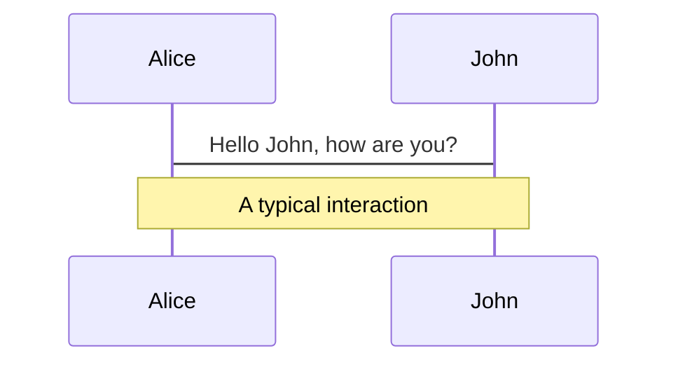
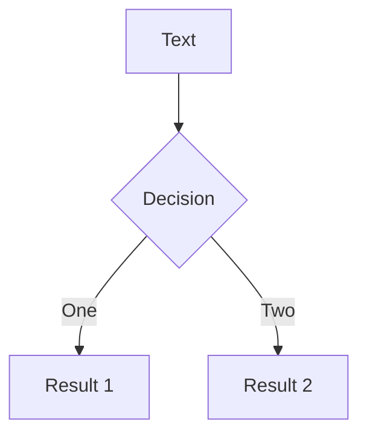
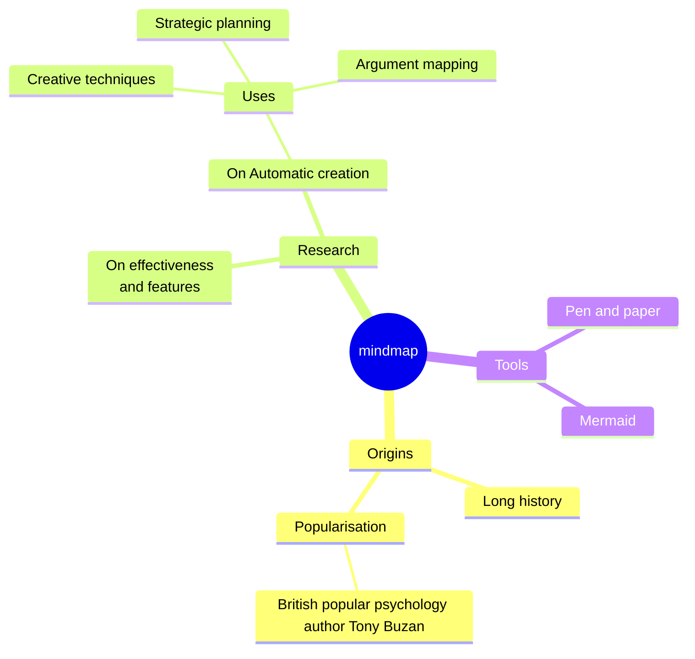
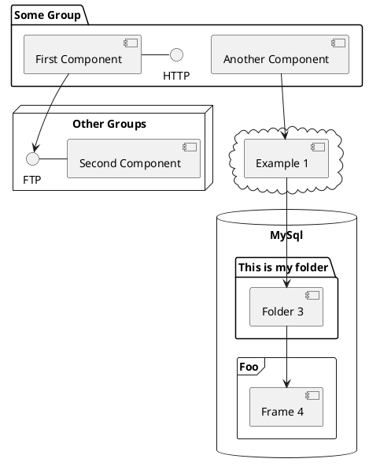

# Exploring Axios

## What Does This Library Do for Us?

<div class="mt-6">
<p>speaker：Monica</p>
<p>2025.5.20 @Langlive Tech Sharing</p>
</div>

<style>
  .slidev-page h1{
    @apply text-size-5xl;
  }
  .slidev-page h2{
    @apply text-light-700;
  }
  .slidev-layout p{
    margin-top: 0px;
    margin-bottom: 0.5rem;
    opacity: 0.6;
  }
</style>

---

```yaml
glowSeed: 15
glowOpacity: 0.3
```

# What is Axios?

- Promise based HTTP client for the browser and node.js
- Built-in many convenient features, such as request/response interceptors, error handling, request cancellation, etc.
<br>
<br>
<div my-10 w-min flex="~ gap-1" items-center justify-center>
  <mdi:github op50 ma text-xl />
  <a href="https://github.com/axios/axios" target="_blank" class="font-300 mr-4">axios</a>
  <mdi:file-document op50 ma text-xl/>
  <a href="https://github.com/axios/axios" target="_blank" class="font-300">axios</a>
</div>

---

# What is Axios?

Axios and Fetch

| Feature                   | axios | fetch                         |
| ------------------------- | ----- | ----------------------------- |
| Automatic JSON parsing    | ✅    | ❌ (requires `res.json()`)    |
| Request Interceptors      | ✅    | ❌                            |
| Response Interceptors     | ✅    | ❌                            |
| Automatic params handling | ✅    | ❌                            |
| Built-in error handling   | ✅    | ❌ (manual handling required) |

---

```yaml
layout: cover
```

# Basic Axios Usage

---

# Basic Axios Usage

<div class='note-block'>
  This axios example and source code version uses v1.8.4
</div>

- Direct axios request
  - `axios(config)`
    ```js
    axios({
      method: 'get',
      url: 'https://jsonplaceholder.typicode.com/posts/1',
      headers: { 'X-Custom-Header': 'foobar' },
    });
    ```
  - `axios(url[, config])`
    ```js
    axios('https://jsonplaceholder.typicode.com/posts/1', {
      headers: { 'X-Custom-Header': 'foobar' },
    });
    ```
  - `axios.requestMethod`
    ```js
    axios.get('https://jsonplaceholder.typicode.com/posts/1');
    ```

---

# Basic Axios Usage

- Create an axios instance for requests
  ```js
  const apiClient = axios.create({
    baseURL: 'https://jsonplaceholder.typicode.com',
    timeout: 5000,
    headers: { 'X-Custom-Header': 'foobar' },
  });
  apiClient.get('/posts/1').then((res) => console.log(res.data));
  ```

---

# Basic Axios Usage - 🔍 Source Code

### axios is exported in <a href='https://github.com/axios/axios/blob/v1.x/lib/axios.js' target='_blank' class='hover:text-[#c5c3fb]!'>lib/axios.js</a>

1. `createInstance`
<div class='ml-6'>

```js
function createInstance(defaultConfig) {
  const context = new Axios(defaultConfig); //  creates a new Axios instance
  const instance = bind(Axios.prototype.request, context); // creates a bound function using the bind method, This creates a function that will call Axios.prototype.request with the correct this context.

  // Copy axios.prototype to instance
  utils.extend(instance, Axios.prototype, context, { allOwnKeys: true });
  // Copy context to instance
  utils.extend(instance, context, null, { allOwnKeys: true });

  // Factory for creating new instances
  instance.create = function create(instanceConfig) {
    return createInstance(mergeConfig(defaultConfig, instanceConfig));
  };
  return instance; //  instance is both a function AND an object
}
```

</div>

---

# Basic Axios Usage - 🔍 Source Code

### axios is exported in <a href='https://github.com/axios/axios/blob/v1.x/lib/axios.js' target='_blank' class='hover:text-[#c5c3fb]!'>lib/axios.js</a>

1. `createInstance`
<div class='ml-6'>

`createInstance` function creates an Axios instance that functions both as a function and an object:

1. Creates a base `Axios` instance (context)
2. Binds `Axios.prototype.request` to context as the main request function
<div class='ml-6'>

- When calling `axios(config)`, it internally executes `Axios.prototype.request.bind(context)(config)`, making the main request function bound to the correct context
</div>

3. Extends instance to include:
<div class='ml-6'>

- Methods from Axios prototype chain (`get`, `post`, etc.)
- Configuration and state from context
</div>

4. Provides `create` method for new instances with merged custom configs

</div>

---

# Basic Axios Usage - 🔍 Source Code

### axios is exported in <a href='https://github.com/axios/axios/blob/v1.x/lib/axios.js' target='_blank' class='hover:text-[#c5c3fb]!'>lib/axios.js</a>

2. Create Default Axios Instance

<div class='ml-6'>

```js
const axios = createInstance(defaults);
```

- Creates an axios instance with default configuration, this is the instance we use directly

</div>

3. Extend Axios Instance with Additional Properties and Methods

<div class='ml-6'>

```js
// ...
axios.spread = spread;

// Expose isAxiosError
axios.isAxiosError = isAxiosError;

// Expose mergeConfig
axios.mergeConfig = mergeConfig;

axios.AxiosHeaders = AxiosHeaders;
// ..
```

</div>

---

# Basic Axios Usage - 🔍 Source Code

<br class='hidden' />

補充：從 [`index.d.ts`](https://github.com/axios/axios/blob/v1.x/index.d.ts) 看預設 axios instance 和 `axios.create` 回傳的 instance 差異

- Global axios is defined as `AxiosStatic`
<div class='ml-6'>

```js{*}{maxHeight:'250px'}
export interface AxiosStatic extends AxiosInstance {
  create(config?: CreateAxiosDefaults): AxiosInstance;
  Cancel: CancelStatic;
  CancelToken: CancelTokenStatic;
  Axios: typeof Axios;
  AxiosError: typeof AxiosError;
  HttpStatusCode: typeof HttpStatusCode;
  readonly VERSION: string;
  isCancel: typeof isCancel;
  all: typeof all;
  spread: typeof spread;
  isAxiosError: typeof isAxiosError;
  toFormData: typeof toFormData;
  formToJSON: typeof formToJSON;
  getAdapter: typeof getAdapter;
  CanceledError: typeof CanceledError;
  AxiosHeaders: typeof AxiosHeaders;
  mergeConfig: typeof mergeConfig;
}

declare const axios: AxiosStatic;
```

</div>

---

# Basic Axios Usage - 🔍 Source Code

<br class='hidden' />

補充：從 [`index.d.ts`](https://github.com/axios/axios/blob/v1.x/index.d.ts) 看預設 axios instance 和 `axios.create` 回傳的 instance 差異

- Instance returned by `axios.create` is defined as `AxiosInstance`

<div class='ml-6'>

```js
export interface AxiosInstance extends Axios {
  <T = any, R = AxiosResponse<T>, D = any>(config: AxiosRequestConfig<D>): Promise<R>;
  <T = any, R = AxiosResponse<T>, D = any>(url: string, config?: AxiosRequestConfig<D>): Promise<R>;

  defaults: Omit<AxiosDefaults, 'headers'> & {
    headers: HeadersDefaults & {
      [key: string]: AxiosHeaderValue
    }
  };
}
```

- `AxiosInstance` doesn't have methods like `isCancel()`, `isAxiosError()`, and can't access properties like `Cancel`, `CancelToken`, `HttpStatusCode`
  - `AxiosInstance` lacks the extension of the `axios` instance from step 3 above

</div>

---

# Basic Axios Usage - 🔍 Source Code

<br class='hidden' />

補充：從 [`index.d.ts`](https://github.com/axios/axios/blob/v1.x/index.d.ts) 看預設 axios instance 和 `axios.create` 回傳的 instance 差異

- `AxiosInstance` doesn't define a `create` method, so can the instance returned by `axios.create` call `create`?

  - In TypeScript type checking, using `AxiosInstance.create` will show an error
    
  - In JavaScript runtime, using `AxiosInstance.create` still works

    ```js
    const instance1 = axios.create({...});
    const instance2 = instance1.create({...});
    instance2.get('/posts/1').then((res) => console.log(res.data)); // Successfully prints data
    ```

    <div class='mt-2'/>

    > The `createInstance` called by `axios.create` assigns a function to `instance.create`

---

```yaml
layout: cover
```

# Axios URL Encoding

---

# Axios URL Encoding

- Axios 幫我們做了什麼？
  - `params` 物件會自動轉換為查詢字串
  - 預設使用 [`encodeURIComponent`](https://developer.mozilla.org/en-US/docs/Web/JavaScript/Reference/Global_Objects/encodeURIComponent) 編碼
  - 支援 [`paramsSerializer`](https://github.com/axios/axios?tab=readme-ov-file#request-config) 來客製化

---

# Axios URL Encoding - axios 與 fetch 範例

<div class="grid grid-cols-[140px_1fr_240px] gap-x-4 mt4">

<div />

###### 程式碼

###### console

<v-clicks :every='3'>

<div class="my-auto leading-6 text-base opacity-75">
axios: ParamsInUrl
</div>

```js
function axiosParamsInUrl() {
  const search = 'hello world!';
  const symbol = '&$';
  const response = await axios.get(
    `${API_URL}/url-encoded?search=${search}&symbol=${symbol}`
  );
  console.log(response.data);
}
```

```js
receivedQuery: {
  search: 'hello world!',
  symbol: '',
  $: ''
}
```

<div class="my-auto leading-6 text-base opacity-75">
axios: AutoEncodeParams
</div>

```js
function axiosAutoEncodeParams() {
  const search = 'hello world!';
  const symbol = '&$';
  const response = await axios.get(`${API_URL}/url-encoded`, {
    params: { search, symbol },
  });
  console.log(response.data);
}
```

```js
receivedQuery: {
  search: 'hello world!',
  symbol: '&$'
}
```

</v-clicks>

</div>

---

# Axios URL Encoding - axios 與 fetch 範例

<div class="grid grid-cols-[140px_1fr_240px] gap-x-4 mt4">

<div />

###### 程式碼

###### console

<v-clicks :every='3'>

<div class="my-auto leading-6 text-base opacity-75">
fetch: WithoutEncode
</div>

```js
function fetchWithoutEncode() {
  const search = 'hello world!';
  const symbol = '&$';
  const res = await fetch(
    `${API_URL}/url-encoded?search=${search}&symbol=${symbol}`
  );
  const data = await res.json();
  console.log(data);
}
```

```js
receivedQuery: {
  search: 'hello world!',
  symbol: '',
  $: ''
}
```

<div class="my-auto leading-6 text-base opacity-75">
fetch: ManualEncode
</div>

```js
function fetchManualEncode() {
  const search = 'hello world!';
  const symbol = '&$';
  const res = await fetch(
    `${API_URL}/url-encoded?search=${encodeURIComponent(
        search
      )}&symbol=${encodeURIComponent(symbol)}`
  );
  const data = await res.json();
  console.log(data);
}
```

```js
receivedQuery: {
  search: 'hello world!',
  symbol: '&$'
}
```

</v-clicks>

</div>

---

# Axios URL Encoding - 🔍 Source Code

---

# Code

Use code snippets and get the highlighting directly, and even types hover!

```ts {all|5|7|7-8|10|all} twoslash
// TwoSlash enables TypeScript hover information
// and errors in markdown code blocks
// More at https://shiki.style/packages/twoslash

import { computed, ref } from 'vue';

const count = ref(0);
const doubled = computed(() => count.value * 2);

doubled.value = 2;
```

<arrow v-click="[4, 5]" x1="350" y1="310" x2="195" y2="334" color="#953" width="2" arrowSize="1" />

<!-- This allow you to embed external code blocks -->

<<< @/snippets/external.ts#snippet

<!-- Footer -->

[Learn more](https://sli.dev/features/line-highlighting)

<!-- Inline style -->
<style>
.footnotes-sep {
  @apply mt-5 opacity-10;
}
.footnotes {
  @apply text-sm opacity-75;
}
.footnote-backref {
  display: none;
}
</style>

<!--
Notes can also sync with clicks

[click] This will be highlighted after the first click

[click] Highlighted with `count = ref(0)`

[click:3] Last click (skip two clicks)
-->

---

## level: 2

# Shiki Magic Move

Powered by [shiki-magic-move](https://shiki-magic-move.netlify.app/), Slidev supports animations across multiple code snippets.

Add multiple code blocks and wrap them with <code>````md magic-move</code> (four backticks) to enable the magic move. For example:

````md magic-move {lines: true}
```ts {*|2|*}
// step 1
const author = reactive({
  name: 'John Doe',
  books: [
    'Vue 2 - Advanced Guide',
    'Vue 3 - Basic Guide',
    'Vue 4 - The Mystery',
  ],
});
```

```ts {*|1-2|3-4|3-4,8}
// step 2
export default {
  data() {
    return {
      author: {
        name: 'John Doe',
        books: [
          'Vue 2 - Advanced Guide',
          'Vue 3 - Basic Guide',
          'Vue 4 - The Mystery',
        ],
      },
    };
  },
};
```

```ts
// step 3
export default {
  data: () => ({
    author: {
      name: 'John Doe',
      books: [
        'Vue 2 - Advanced Guide',
        'Vue 3 - Basic Guide',
        'Vue 4 - The Mystery',
      ],
    },
  }),
};
```

Non-code blocks are ignored.

```vue
<!-- step 4 -->
<script setup>
const author = {
  name: 'John Doe',
  books: [
    'Vue 2 - Advanced Guide',
    'Vue 3 - Basic Guide',
    'Vue 4 - The Mystery',
  ],
};
</script>
```
````

---

# Components

<div grid="~ cols-2 gap-4">
<div>

You can use Vue components directly inside your slides.

We have provided a few built-in components like `<Tweet/>` and `<Youtube/>` that you can use directly. And adding your custom components is also super easy.

```html
<Counter :count="10" />
```

<!-- ./components/Counter.vue -->
<Counter :count="10" m="t-4" />

Check out [the guides](https://sli.dev/builtin/components.html) for more.

</div>
<div>

```html
<Tweet id="1390115482657726468" />
```

<Tweet id="1390115482657726468" scale="0.65" />

</div>
</div>

<!--
Presenter note with **bold**, *italic*, and ~~striked~~ text.

Also, HTML elements are valid:
<div class="flex w-full">
  <span style="flex-grow: 1;">Left content</span>
  <span>Right content</span>
</div>
-->

---

## class: px-20

# Themes

Slidev comes with powerful theming support. Themes can provide styles, layouts, components, or even configurations for tools. Switching between themes by just **one edit** in your frontmatter:

<div grid="~ cols-2 gap-2" m="t-2">

```yaml
---
theme: default
---
```

```yaml
---
theme: seriph
---
```


</div>

Read more about [How to use a theme](https://sli.dev/guide/theme-addon#use-theme) and
check out the [Awesome Themes Gallery](https://sli.dev/resources/theme-gallery).

---

# Clicks Animations

You can add `v-click` to elements to add a click animation.

<div v-click>

This shows up when you click the slide:

```html
<div v-click>This shows up when you click the slide.</div>
```

</div>

<br>

<v-click>

The <span v-mark.red="3"><code>v-mark</code> directive</span>
also allows you to add
<span v-mark.circle.orange="4">inline marks</span>
, powered by [Rough Notation](https://roughnotation.com/):

```html
<span v-mark.underline.orange>inline markers</span>
```

</v-click>

<div mt-20 v-click>

[Learn more](https://sli.dev/guide/animations#click-animation)

</div>

---

# Motions

Motion animations are powered by [@vueuse/motion](https://motion.vueuse.org/), triggered by `v-motion` directive.

```html
<div
  v-motion
  :initial="{ x: -80 }"
  :enter="{ x: 0 }"
  :click-3="{ x: 80 }"
  :leave="{ x: 1000 }"
>
  Slidev
</div>
```

<div class="w-60 relative">
  <div class="relative w-40 h-40">
    
    
    
  </div>

  <div
    class="text-5xl absolute top-14 left-40 text-[#2B90B6] -z-1"
    v-motion
    :initial="{ x: -80, opacity: 0}"
    :enter="{ x: 0, opacity: 1, transition: { delay: 2000, duration: 1000 } }">
    Slidev
  </div>
</div>

<!-- vue script setup scripts can be directly used in markdown, and will only affects current page -->
<script setup lang="ts">
const final = {
  x: 0,
  y: 0,
  rotate: 0,
  scale: 1,
  transition: {
    type: 'spring',
    damping: 10,
    stiffness: 20,
    mass: 2
  }
}
</script>

<div
  v-motion
  :initial="{ x:35, y: 30, opacity: 0}"
  :enter="{ y: 0, opacity: 1, transition: { delay: 3500 } }">

[Learn more](https://sli.dev/guide/animations.html#motion)

</div>

---

# LaTeX

LaTeX is supported out-of-box. Powered by [KaTeX](https://katex.org/).

<div h-3 />

Inline $\sqrt{3x-1}+(1+x)^2$

Block

$$
{1|3|all}
\begin{aligned}
\nabla \cdot \vec{E} &= \frac{\rho}{\varepsilon_0} \\
\nabla \cdot \vec{B} &= 0 \\
\nabla \times \vec{E} &= -\frac{\partial\vec{B}}{\partial t} \\
\nabla \times \vec{B} &= \mu_0\vec{J} + \mu_0\varepsilon_0\frac{\partial\vec{E}}{\partial t}
\end{aligned}
$$

[Learn more](https://sli.dev/features/latex)

---

# Diagrams

You can create diagrams / graphs from textual descriptions, directly in your Markdown.

<div class="grid grid-cols-4 gap-5 pt-4 -mb-6">









</div>

Learn more: [Mermaid Diagrams](https://sli.dev/features/mermaid) and [PlantUML Diagrams](https://sli.dev/features/plantuml)

---

foo: bar
dragPos:
square: 691,32,167,\_,-16

---

dragPos:
square: -114,0,0,0

---

dragPos:
square: -114,0,0,0

---

dragPos:
square: -114,0,0,0

---

dragPos:
square: -114,0,0,0

---

dragPos:
square: -114,0,0,0

---

dragPos:
square: -114,0,0,0

---

dragPos:
square: -114,0,0,0

---

dragPos:
square: -114,0,0,0

---

dragPos:
square: -114,0,0,0

---

dragPos:
square: -114,0,0,0

---

dragPos:
square: -114,0,0,0

---

dragPos:
square: -114,0,0,0

---

dragPos:
square: -114,0,0,0

---

dragPos:
square: -114,0,0,0

---

dragPos:
square: -114,0,0,0

---

dragPos:
square: -114,0,0,0

---

dragPos:
square: -114,0,0,0

---

dragPos:
square: -114,0,0,0

---

dragPos:
square: -114,0,0,0

---

dragPos:
square: -114,0,0,0

---

dragPos:
square: -114,0,0,0

---

dragPos:
square: -114,0,0,0

---

dragPos:
square: -114,0,0,0

---

dragPos:
square: -114,0,0,0

---

dragPos:
square: -114,0,0,0

---

dragPos:
square: -114,0,0,0

---

dragPos:
square: NaN,NaN,NaN,NaN

---

dragPos:
square: NaN,NaN,NaN,NaN

---

dragPos:
square: -114,0,0,0

---

dragPos:
square: NaN,NaN,NaN,NaN

---

dragPos:
square: -114,0,0,0

---

dragPos:
square: -114,0,0,0

---

# Draggable Elements

Double-click on the draggable elements to edit their positions.

<br>

###### Directive Usage

```md

```

<br>

###### Component Usage

```md
<v-drag text-3xl>
  <div class="i-carbon:arrow-up" />
  Use the `v-drag` component to have a draggable container!
</v-drag>
```

<v-drag pos="663,206,261,_,-15">
  <div text-center text-3xl border border-main rounded>
    Double-click me!
  </div>
</v-drag>


###### Draggable Arrow

```md
<v-drag-arrow two-way />
```

<v-drag-arrow pos="67,452,253,46" two-way op70 />

---

src: ./pages/imported-slides.md
hide: false

---

---

# Monaco Editor

Slidev provides built-in Monaco Editor support.

Add `{monaco}` to the code block to turn it into an editor:

```ts {monaco}
import { ref } from 'vue';
import { emptyArray } from './external';

const arr = ref(emptyArray(10));
```

Use `{monaco-run}` to create an editor that can execute the code directly in the slide:

```ts {monaco-run}
import { version } from 'vue';
import { emptyArray, sayHello } from './external';

sayHello();
console.log(`vue ${version}`);
console.log(
  emptyArray<number>(10).reduce(
    (fib) => [...fib, fib.at(-1)! + fib.at(-2)!],
    [1, 1]
  )
);
```

---

layout: center
class: text-center

---

# Learn More

[Documentation](https://sli.dev) · [GitHub](https://github.com/slidevjs/slidev) · [Showcases](https://sli.dev/resources/showcases)

<PoweredBySlidev mt-10 />
